# Automation
## GitOps
GitOps is a cloud-native operating model that leverages Git as the single source of truth for both infrastructure and application deployments. By applying DevOps best practices—such as version control, collaboration, and compliance—to the entire delivery pipeline, it enables developers to manage complex Kubernetes environments through familiar Git workflows. When a change is pushed to a repository, automated tools like Flux or Argo CD ensure the live state of the cluster matches the desired state defined in code, resulting in faster, more reliable, and highly scalable deployments with reduced operational overhead.
### Flux
Prepare your environment for this section:
``` bash
prepare-environment automation/gitops/flux
```
This will make the following changes to your lab environment:
- Install the AWS Load Balancer controller in the Amazon EKS cluster
- Install the EKS managed addon for the EBS CSI driver

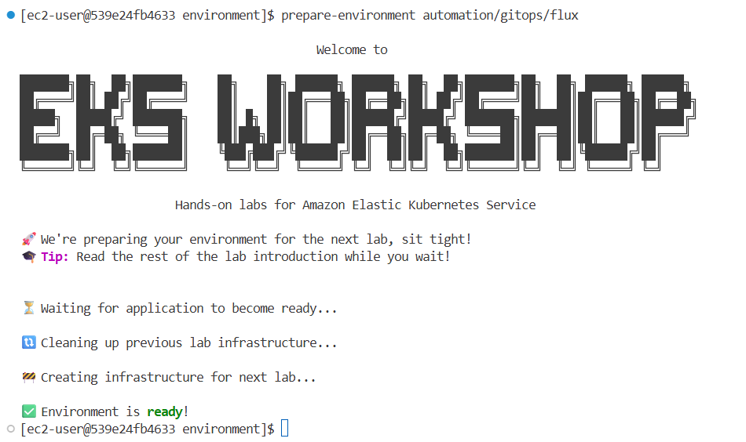
#### Setup Getea 
1. Install Gitea in EKS cluster with Helm:

2. Make sure that Gitea is up and running before proceeding:
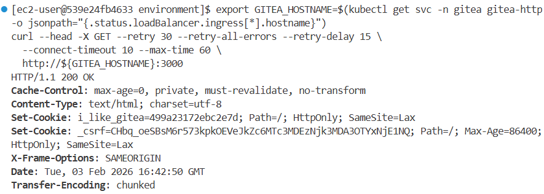
3. An SSH key will be needed to interact with Git. The environment preparation for this lab created one, we just need to register it with Gitea:
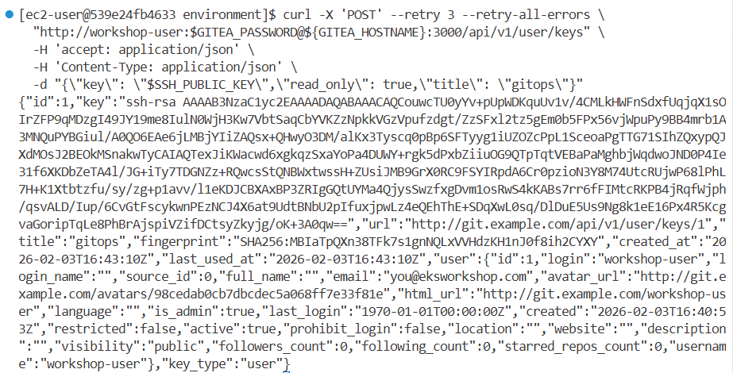
4. And also need to create the Gitea repository that Flux will use:

5. Finally set up an identity that Git will use for our commits:
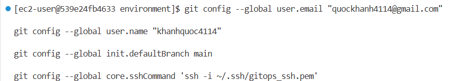
#### Cluter bootstrap
Run pre-bootstrap checks to verify that everything is set up correctly. Run the following command for Flux CLI to perform the checks:
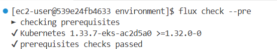
Now we can bootstrap Flux on our EKS cluster using a Gitea repository:


Now, let's verify that the bootstrap process completed successfully by running the following command:
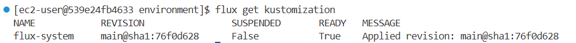
#### Deploying an application
First let's remove the existing UI component so we can replace it:
Next, clone the repository we used to bootstrap Flux in the previous section:

Now, let's start populating the Flux repository by creating a directory for our "apps". This directory is designed to contain a sub-directory for each application component:
```bash
mkdir ~/environment/flux/apps
```
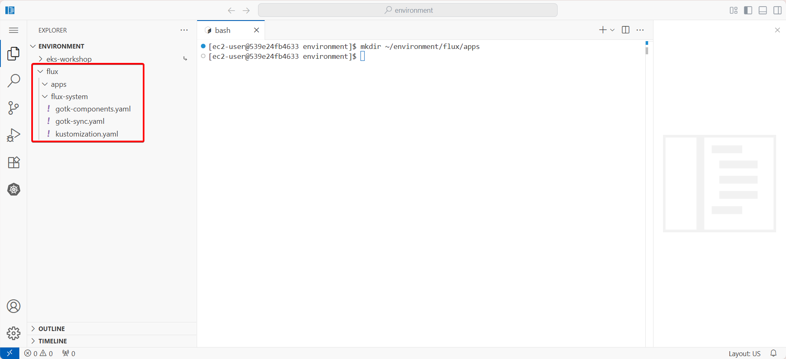
Copy this file to the Git repository directory:
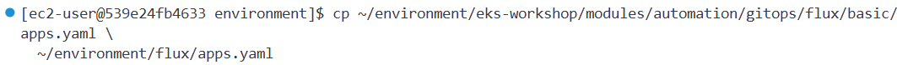
Copy this file to the Git repository directory:
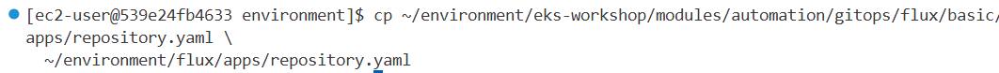
Copy the appropriate files to the Git repository directory:
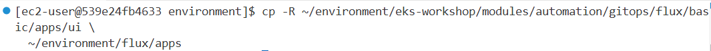
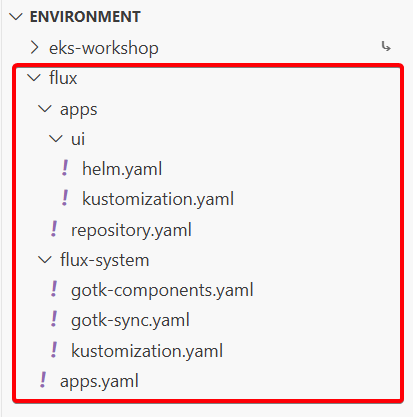
Finally we can push our configuration to Git:
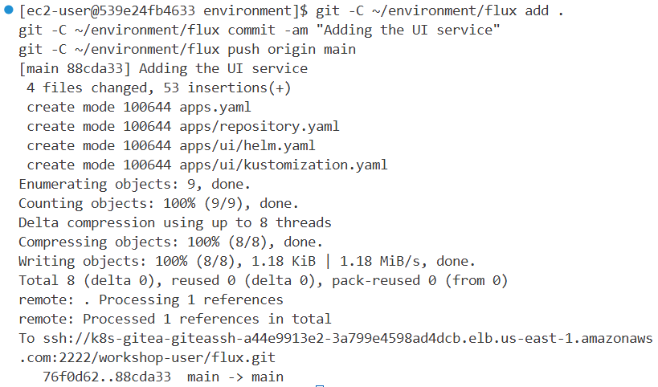
It will take Flux some time to notice the changes in Git and reconcile. You can use the Flux CLI to watch for our new apps kustomization to appear:
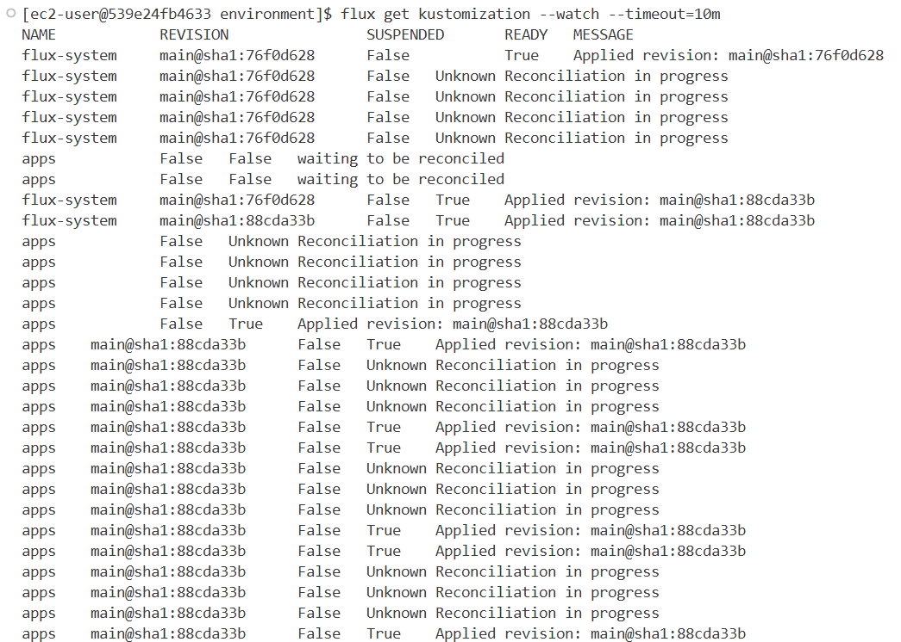
Once apps appears as indicated above use Ctrl+C to close the command. You should now have all the resources related to the UI services deployed once more. To verify, run the following commands:
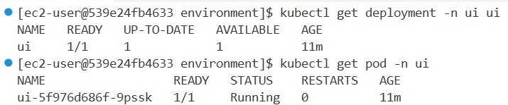
Get the URL from the Ingress resource:

To wait until the load balancer has finished provisioning you can run this command:

And access it in your web browser. You will see the UI from the web store displayed and will be able to navigate around the site as a user.

### ArgoCD

#### Setting up Gitea
Let's install Gitea in our EKS cluster with Helm:
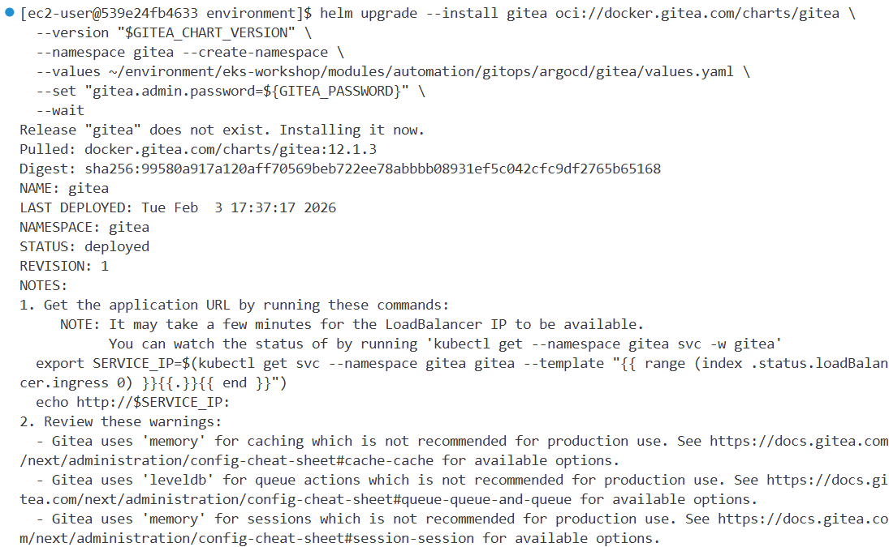
Make sure that Gitea is up and running before proceeding:
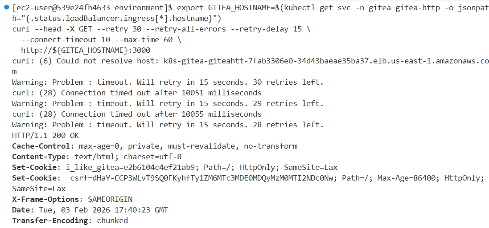
An SSH key will be needed to interact with Git. The environment preparation for this lab created one, we just need to register it with Gitea:

And we'll also need to create the Gitea repository that Argo CD will use:

Now we can set up an identity that Git will use for our commits:
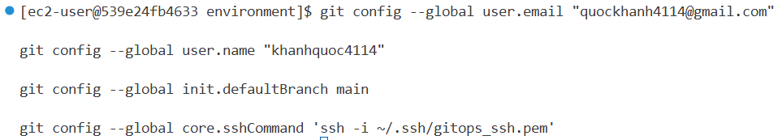
And finally let's clone the repository and set up the initial structure:
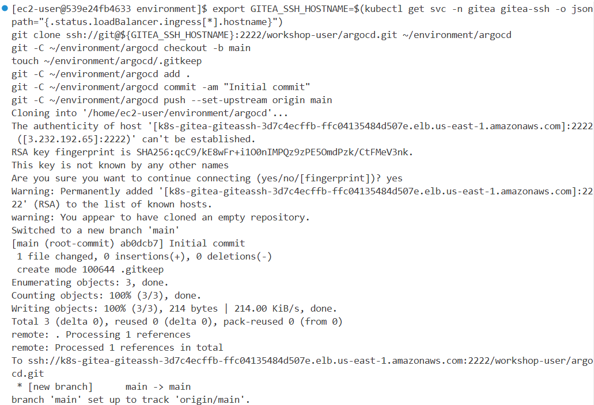
#### Installing Argo CD
Let's begin by installing Argo CD in our cluster:

For the purpose of this lab, the Argo CD server UI has been configured to be accessible outside of the cluster using a Kubernetes service with a load balancer. To obtain the URL, execute the following commands:

The load balancer will take some time to provision. Use this command to wait until Argo CD responds:

For authentication, the default username is admin and the password is auto-generated. Retrieve the password with the following command:

Use the URL and credentials you just obtained to log in to the Argo CD UI.
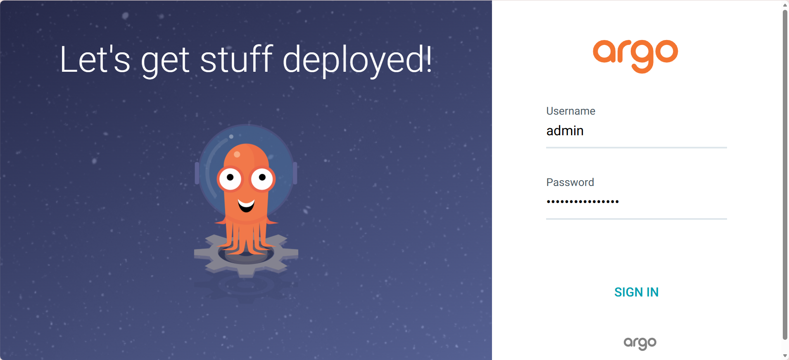

To interact with Argo CD using the CLI, you need to authenticate with the Argo CD server:

Finally, register the Git repository with Argo CD to provide access:
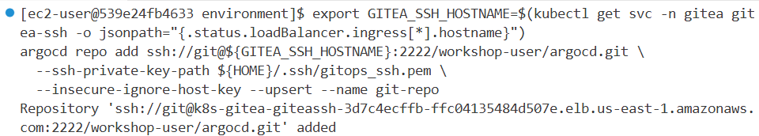
#### Deploying an application
First, let's remove the existing sample application from the cluster:

Let's copy this file to our Git directory:
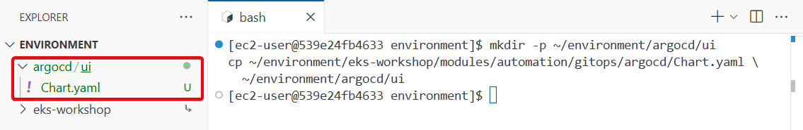
Now we'll push our configuration to the Git repository:

Next, let's create an Argo CD Application configured to use our Git repository:
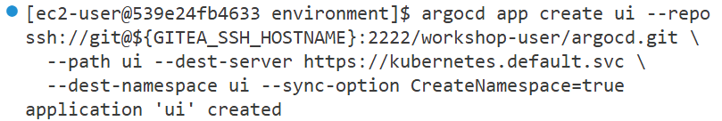
We can verify that the application has been created:
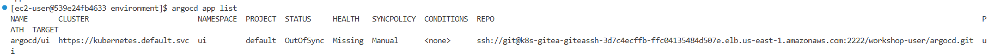
This application is now visible in the Argo CD UI:
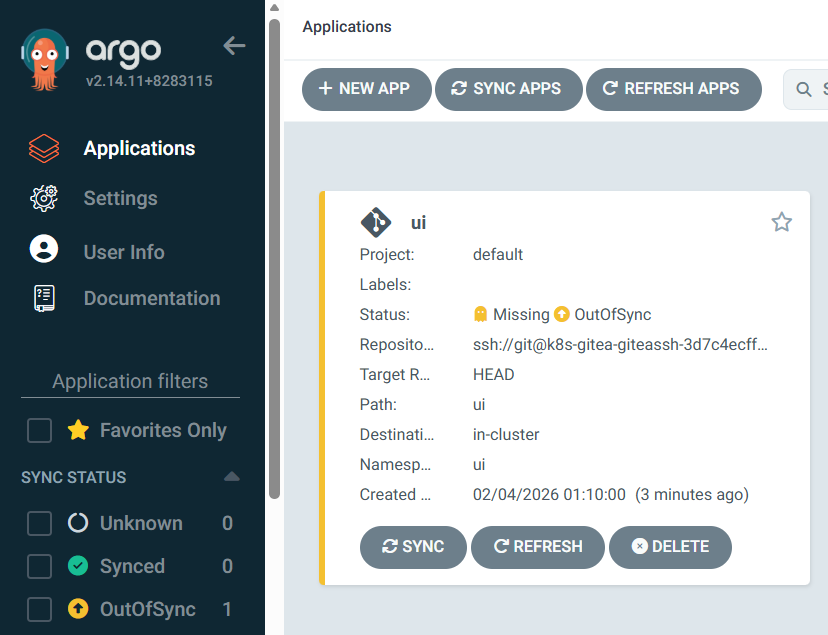

In Argo CD, "out of sync" indicates that the desired state defined in your Git repository doesn't match the actual state in your Kubernetes cluster. Although Argo CD is capable of automated synchronization, for now we'll manually trigger this process:


After a short period, the application should reach the Synced state, with all resources deployed. The UI should look like this:
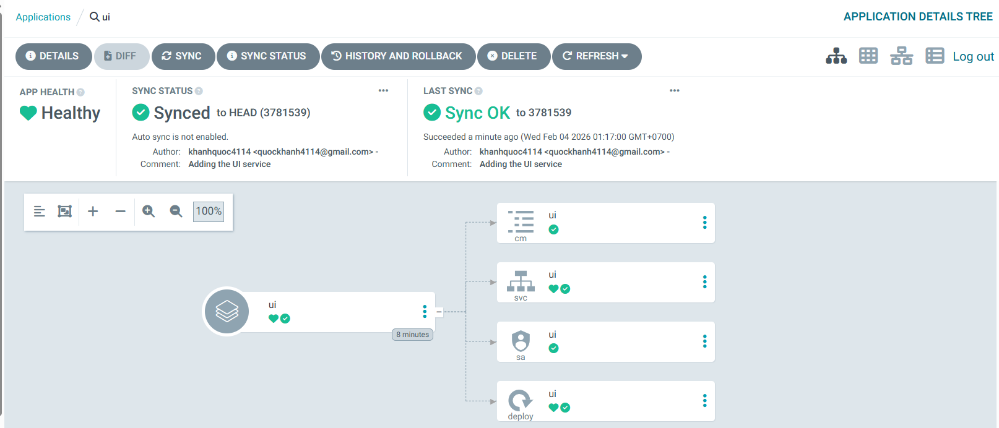
To verify that all resources related to the UI service are deployed, run the following commands:

#### Updating an application
Let's copy this configuration file to our Git repository directory:
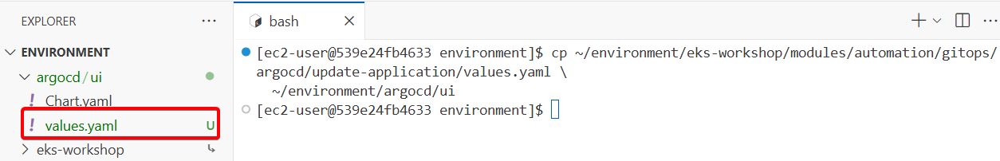
Now we'll commit and push our changes to the Git repository:

At this point, Argo CD will detect that the application state in the repository has changed. You can either click Refresh and then Sync in the Argo CD UI, or use the argocd CLI to synchronize the application:
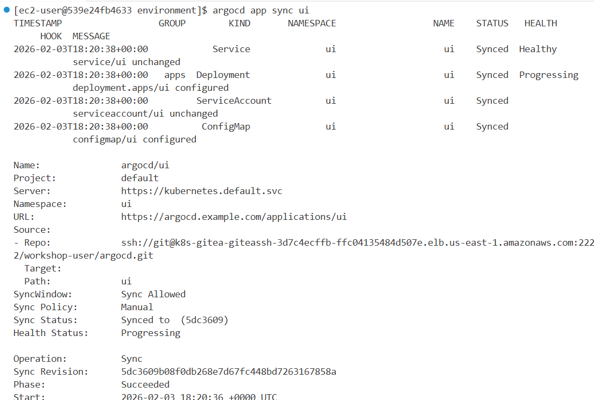

After synchronization completes, the UI deployment should now have 3 pods running:
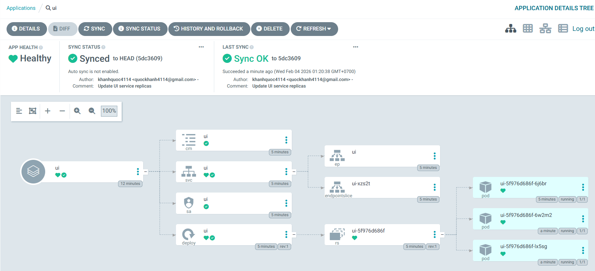
To verify that our update was successful, let's check the deployment and pod status:
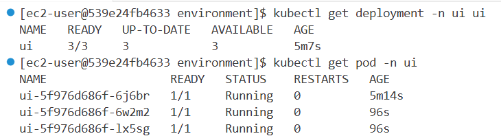


#### App of app
##### Setup
First, let's copy this foundational App of Apps configuration to our Git directory:

Now, let's commit and push these changes to the Git repository:

Next, we need to create a new Argo CD Application to implement the App of Apps pattern. While doing this, we'll enable Argo CD to automatically synchronize the state in the cluster with the configuration in the Git repository using the --sync-policy automated flag:
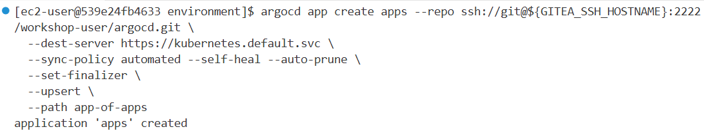

##### Adding more workloads 
Let's copy the application chart files to our Git repository directory:
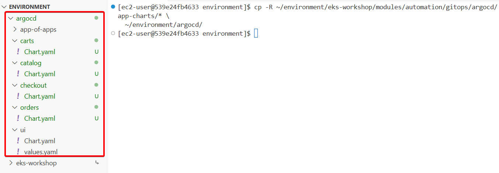
Next, commit and push these changes to the Git repository:

Sync the apps application:


When Argo CD completes the process, all our applications will be in the Synced state as shown in the Argo CD UI:

We should now see a set of new namespaces with each application component deployed:

Let's examine one of the deployed workloads more closely. For example, we can check the carts component:
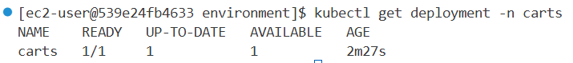

## Control Planes
### AWS Controllers for Kubernetes (ACK)
AWS Controllers for Kubernetes (ACK) is an open-source framework that allows you to manage AWS managed services directly through the Kubernetes API. Instead of context-switching between the AWS Console, Terraform, or CloudFormation, platform engineers can define resources like Amazon RDS, SQS, or DynamoDB using standard Kubernetes YAML manifests. This "GitOps-friendly" approach treats cloud infrastructure exactly like containerized application code, ensuring that your application's dependencies (e.g., a database) are versioned and deployed alongside the application itself. By leveraging ACK via Helm or Terraform, teams can reduce operational overhead and ensure environment consistency across testing and production.
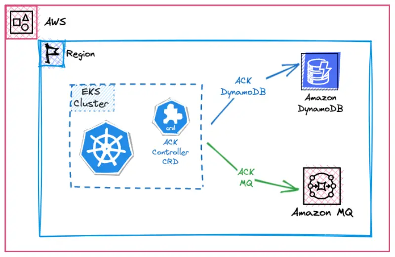

Prepare your environment for this section:
``` bash
prepare-environment automation/controlplanes/ack
```
This will make the following changes to your lab environment:
- Install the AWS Controllers for DynamoDB in the Amazon EKS cluster
#### Introduction
In this section, since we'll be working with Amazon DynamoDB ACK, we first need to install that ACK controller by using the Helm chart:
``` bash
aws ecr-public get-login-password --region us-east-1 | \
  helm registry login --username AWS --password-stdin public.ecr.aws
helm install ack-dynamodb  \
  oci://public.ecr.aws/aws-controllers-k8s/dynamodb-chart \
  --version=${DYNAMO_ACK_VERSION} \
  --namespace ack-system --create-namespace \
  --set "aws.region=${AWS_REGION}" \
  --set "serviceAccount.annotations.eks\\.amazonaws\\.com/role-arn"="$ACK_IAM_ROLE" \
  --wait
```


The controller will be running as a deployment in the ack-system namespace:
```bash
kubectl get deployment -n ack-system
```
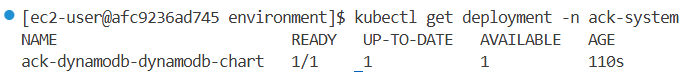

#### How does ACK works?
To gain deeper insight into the objects and API calls the controller listens for, you can run:
``` bash
kubectl get crd
```

#### Provisioning ACK resources
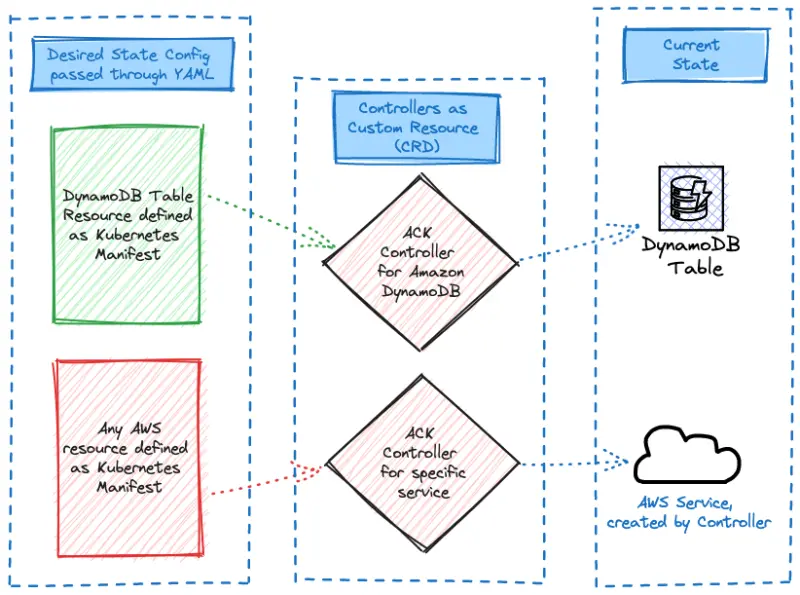
Now, let's apply these updates to the cluster:
```bash
kubectl kustomize ~/environment/eks-workshop/modules/automation/controlplanes/ack/dynamodb \
  | envsubst | kubectl apply -f-
```
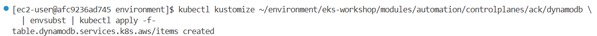
The ACK controllers in the cluster will respond to these new resources and provision the AWS infrastructure we've defined in the manifests. To verify that ACK has created the table, run the following command:
``` bash
kubectl wait table.dynamodb.services.k8s.aws items -n carts --for=condition=ACK.ResourceSynced --timeout=15m
kubectl get table.dynamodb.services.k8s.aws items -n carts -ojson | yq '.status."tableStatus"'
```


Finally, let's confirm that the table has been created using the AWS CLI:
``` bash
aws dynamodb list-tables
```
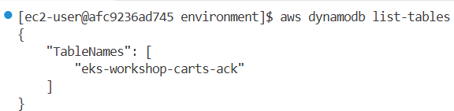
#### Updating the application
Let's apply this new configuration:
``` bash
kubectl kustomize ~/environment/eks-workshop/modules/automation/controlplanes/ack/app \
  | envsubst | kubectl apply -f-
```

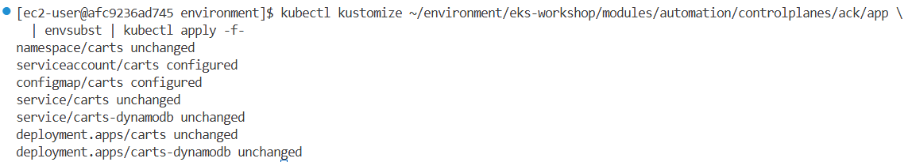

Now we need to restart the carts Pods to pick up our new ConfigMap contents:
``` bash
kubectl rollout restart -n carts deployment/carts
kubectl rollout status -n carts deployment/carts --timeout=40s
```
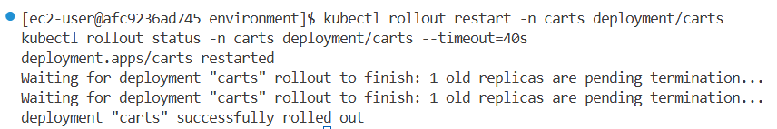
To verify that the application is working with the new DynamoDB table, we can interact with it through a browser. An NLB has been created to expose the sample application for testing:
``` bash
LB_HOSTNAME=$(kubectl -n ui get service ui-nlb -o jsonpath='{.status.loadBalancer.ingress[*].hostname}{"\n"}')
echo "http://$LB_HOSTNAME"
```

To wait until the load balancer has finished provisioning, you can run this command:
```bash
wait-for-lb $(kubectl get service -n ui ui-nlb -o jsonpath="{.status.loadBalancer.ingress[*].hostname}{'\n'}")
```
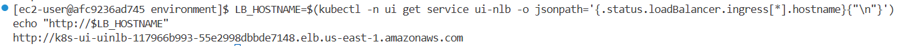
The UI from the web store displayed and will be able to navigate around the site as a user.


To confirm that these items are also in the DynamoDB table, run:
``` bash
aws dynamodb scan --table-name "${EKS_CLUSTER_NAME}-carts-ack"
```
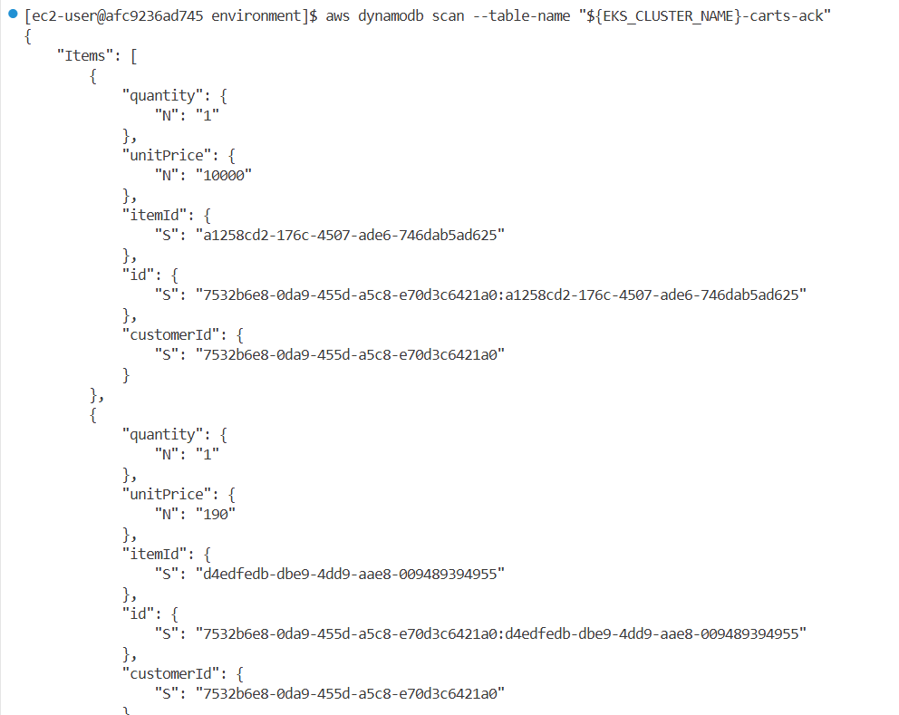
### Crossplane

Crossplane is an open-source CNCF project that transforms your Kubernetes cluster into a universal control plane. It enables platform teams to assemble infrastructure from multiple vendors and expose higher-level self-service APIs for application teams.

#### Prepare Environment
```bash
prepare-environment automation/controlplanes/crossplane
```
This will make the following changes to your lab environment:
- Install Crossplane and the AWS provider in the Amazon EKS cluster

#### How it works

Crossplane operates with two primary components:
1. **Crossplane controller**: Provides core functionality
2. **Crossplane providers**: Controllers and CRDs to integrate with specific providers (e.g., AWS)

**Step 1:** Verify Crossplane deployments
```bash
kubectl get deployment -n crossplane-system
```

Key components:
- `crossplane` - Core controller
- `crossplane-rbac-manager` - RBAC management
- `upbound-provider-family-aws` - AWS provider
- `upbound-aws-provider-dynamodb` - DynamoDB-specific provider

**Step 2:** Understand the architecture
- **Claims**: Namespace-scoped resources (developer interface)
- **Composite Resources (XR)**: Custom resources representing cloud resources
- **Managed Resources**: Interact directly with AWS API
- **Compositions**: Templates defining how XRs create Managed Resources


#### Managed Resources

**Step 1:** Create DynamoDB table using managed resource
```bash
kubectl kustomize ~/environment/eks-workshop/modules/automation/controlplanes/crossplane/managed \
  | envsubst | kubectl apply -f-
```

**Step 2:** Wait for table to be ready
```bash
kubectl wait tables.dynamodb.aws.upbound.io ${EKS_CLUSTER_NAME}-carts-crossplane \
  --for=condition=Ready --timeout=5m
```

**Step 3:** Verify table status
```bash
kubectl get tables.dynamodb.aws.upbound.io
```


#### Updating the Application

**Step 1:** Update ConfigMap to use new DynamoDB table
```bash
kubectl kustomize ~/environment/eks-workshop/modules/automation/controlplanes/crossplane/app \
  | envsubst | kubectl apply -f-
```

**Step 2:** Restart carts pods
```bash
kubectl rollout restart -n carts deployment/carts
kubectl rollout status -n carts deployment/carts --timeout=40s
```

**Step 3:** Verify application works with DynamoDB
```bash
aws dynamodb scan --table-name "${EKS_CLUSTER_NAME}-carts-crossplane"
```


#### Compositions

Compositions enable platform teams to create opinionated templates for deploying cloud resources with enforced standards (tags, encryption, configurations).

**Step 1:** Create CompositeResourceDefinition (XRD)
XRD defines the schema for your custom API. Developers only need to specify:
- Table name
- Key attributes
- Index name

**Step 2:** Create Composition
Composition defines what resources to create when an XR is created.

**Step 3:** Apply composition and XRD
```bash
kubectl apply -k ~/environment/eks-workshop/modules/automation/controlplanes/crossplane/compositions/composition
```


#### Claims

Claims are lightweight proxy resources for creating XRs. Developers use simple specifications while platform teams control underlying implementation.

**Step 1:** Clean up previous managed resource
```bash
kubectl delete tables.dynamodb.aws.upbound.io --all --ignore-not-found=true
kubectl wait --for=delete tables.dynamodb.aws.upbound.io --all --timeout=5m
```

**Step 2:** Create DynamoDB table using Claim
```bash
cat ~/environment/eks-workshop/modules/automation/controlplanes/crossplane/compositions/claim/claim.yaml \
  | envsubst | kubectl -n carts apply -f -
kubectl wait dynamodbtables.awsblueprints.io ${EKS_CLUSTER_NAME}-carts-crossplane -n carts \
  --for=condition=Ready --timeout=5m
```

**Step 3:** Verify resources created
```bash
kubectl get table
kubectl get DynamoDBTable -n carts
kubectl get XDynamoDBTable
kubectl get composition
```


**Step 4:** Test application and verify data in DynamoDB
```bash
aws dynamodb scan --table-name "${EKS_CLUSTER_NAME}-carts-crossplane"
```

### kro - Kube Resource Orchestrator

kro (Kube Resource Orchestrator) is an open-source Kubernetes operator that enables you to define custom APIs through ResourceGraphDefinitions (RGDs). It uses CEL (Common Expression Language) to handle dependencies, conditional logic, and value passing between resources. kro intelligently analyzes resource relationships to determine the correct deployment order.

#### Prepare your environment for this section:

``` bash 
prepare-environment automation/controlplanes/kro
``` 
This will make the following changes to your lab environment:
- Install the AWS Controllers for Kubernetes controllers for EKS, IAM and DynamoDB
- Install the AWS Load Balancer Controller
- Create an Ingress resource for the UI workload

#### Introduction

**Step 1:** Install kro using Helm
```bash
helm install kro oci://ghcr.io/kro-run/kro/kro \
  --version=${KRO_VERSION} \
  --namespace kro-system --create-namespace \
  --wait
```


**Step 2:** Verify kro controller is running
```bash
kubectl get deployment -n kro-system
```
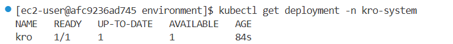
**Step 3:** Verify CRDs installed
```bash
kubectl get crd | grep kro
```

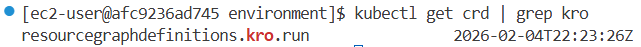

#### How kro works

When you create a ResourceGraphDefinition, kro:
1. Registers a new Custom API based on the RGD schema
2. Processes resource instances when developers create custom API instances
3. Evaluates CEL expressions for conditions and value passing
4. Analyzes dependencies and determines optimal deployment order
5. Creates managed resources in correct order
6. Maintains relationships and lifecycle management

#### Creating resources with kro

**Step 1:** Clean up existing carts deployment
```bash
kubectl delete all --all -n carts
```

**Step 2:** Apply WebApplication ResourceGraphDefinition
```bash
kubectl apply -f ~/environment/eks-workshop/modules/automation/controlplanes/kro/rgds/webapp-rgd.yaml
```
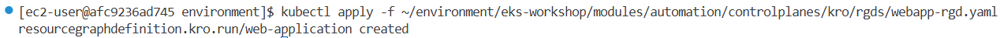
**Step 3:** Verify CRD created
```bash
kubectl get crd webapplications.kro.run
```

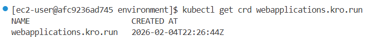

**Step 4:** Deploy carts using WebApplication API
```bash
kubectl apply -f ~/environment/eks-workshop/modules/automation/controlplanes/kro/app/carts.yaml
```

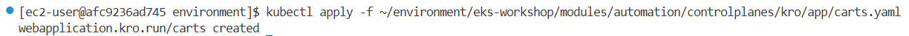

**Step 5:** Wait for sync
```bash
kubectl wait webapplication/carts -n carts \
  --for=condition=InstanceSynced=True --timeout=120s
```

**Step 6:** Verify resources
```bash
kubectl get webapplication -n carts
kubectl get all -n carts
```

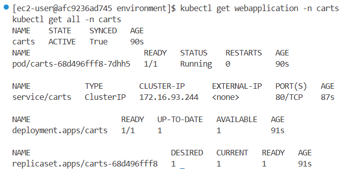

#### Provisioning cloud resources

Compose WebApplicationDynamoDB RGD that builds on base WebApplication template to add DynamoDB storage.

**Step 1:** Delete previous kro instance
```bash
kubectl delete webapplication.kro.run/carts -n carts
kubectl get all -n carts
```
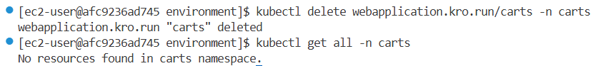
**Step 2:** Apply WebApplicationDynamoDB RGD
```bash
kubectl apply -f ~/environment/eks-workshop/modules/automation/controlplanes/kro/rgds/webapp-dynamodb-rgd.yaml
```
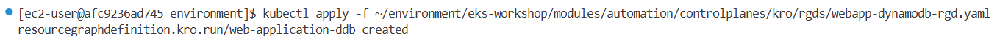
This RGD:
- Creates custom `WebApplicationDynamoDB` API
- Provisions DynamoDB table with ACK
- Creates IAM roles and policies
- Configures EKS Pod Identity

**Step 3:** Verify CRD created
```bash
kubectl get crd webapplicationdynamodbs.kro.run
```
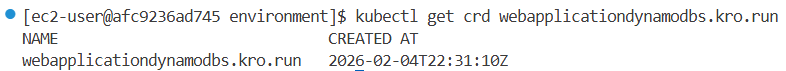
**Step 4:** Deploy carts with DynamoDB
```bash
kubectl kustomize ~/environment/eks-workshop/modules/automation/controlplanes/kro/app \
  | envsubst | kubectl apply -f-
```
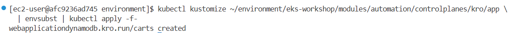
**Step 5:** Wait for sync
```bash
kubectl wait webapplicationdynamodb/carts -n carts \
  --for=condition=InstanceSynced=True --timeout=120s
```
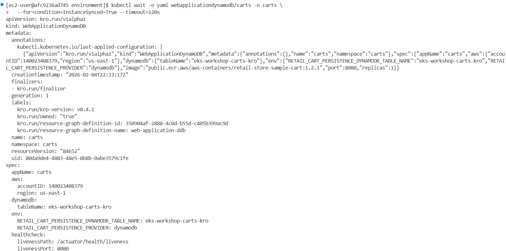
**Step 6:** Verify DynamoDB table created
```bash
kubectl wait table.dynamodb.services.k8s.aws items -n carts --for=condition=ACK.ResourceSynced --timeout=15m
kubectl get table.dynamodb.services.k8s.aws items -n carts -ojson | yq '.status."tableStatus"'
aws dynamodb list-tables
```


**Step 7:** Test application with DynamoDB
To verify that the component is working with the new DynamoDB table, we can interact with it through a browser. An NLB has been created to expose the sample application for testing:
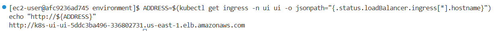

Go to site and but some items


```bash
aws dynamodb scan --table-name "eks-workshop-carts-kro"
```


