# Introduction

This EKS Workshop adapts it for running the labs with **your own AWS account**. It focuses on the core purpose and flow of the workshop and omits promotional links, legal text, and external event registrations.

## What this workshop covers

The workshop is a set of hands-on labs that teach Amazon EKS features and how EKS integrates with other AWS services. You can choose any combination of modules based on your needs and experience:

- Introduction: Understand the workshop format and structure.
- Fundamentals: Core EKS concepts (managed node groups, Fargate, app exposure, storage).
- Autoscaling: Horizontal and vertical scaling for workloads and clusters.
- Observability: Monitoring and operational insights for production readiness.
- Security: Container security practices for clusters and workloads.
- Networking: How EKS networking integrates with Amazon VPC and related services.
- Automation: GitOps principles and infrastructure provisioning.

---

# Using eksctl (in your AWS account)

This is the configuration that will be used to build the cluster:

``` yaml
apiVersion: eksctl.io/v1alpha5
kind: ClusterConfig
availabilityZones:
  - ${AWS_REGION}a
  - ${AWS_REGION}b
  - ${AWS_REGION}c
metadata:
  name: ${EKS_CLUSTER_NAME}
  region: ${AWS_REGION}
  version: "1.33"
  tags:
    karpenter.sh/discovery: ${EKS_CLUSTER_NAME}
    created-by: eks-workshop-v2
    env: ${EKS_CLUSTER_NAME}
iam:
  withOIDC: true
vpc:
  cidr: 10.42.0.0/16
  clusterEndpoints:
    privateAccess: true
    publicAccess: true
managedNodeGroups:
  - name: default
    desiredCapacity: 3
    minSize: 3
    maxSize: 6
    instanceType: m5.large
    privateNetworking: true
    releaseVersion: "1.33.0-20250704"
    updateConfig:
      maxUnavailablePercentage: 50
    labels:
      workshop-default: "yes"
addons:
  - name: vpc-cni
    version: 1.19.2
    configurationValues: '{"env":{"ENABLE_PREFIX_DELEGATION":"true", "ENABLE_POD_ENI":"true", "POD_SECURITY_GROUP_ENFORCING_MODE":"standard"},"enableNetworkPolicy": "true", "nodeAgent": {"enablePolicyEventLogs": "true"}}'
    resolveConflicts: overwrite
remoteNetworkConfig:
  remoteNodeNetworks:
    - cidrs: ["10.52.0.0/16"]
  remotePodNetworks:
    - cidrs: ["10.53.0.0/16"]
```
Apply the configuration file:
```bash
export EKS_CLUSTER_NAME=eks-workshop
export AWS_REGION=us-east-1
curl -fsSL https://raw.githubusercontent.com/aws-samples/eks-workshop-v2/stable/cluster/eksctl/cluster.yaml | \
envsubst | eksctl create cluster -f -
```

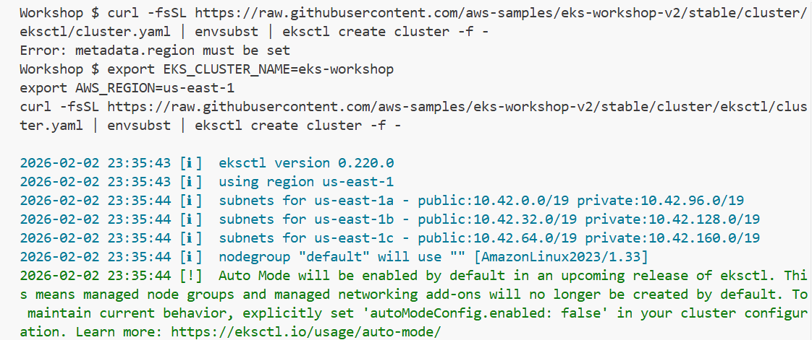

### Next step

## Cleanup 

First, use delete-environment to ensure that the sample application and any left-over lab infrastructure is removed:
```bash
delete-environment
```

Next, delete the cluster with eksctl:
``` bash
eksctl delete cluster $EKS_CLUSTER_NAME --wait
```

## Getting started

### Sample application

The labs use a shared retail-store sample app. It includes a UI and multiple backend services that simulate a storefront where users browse items, add them to a cart, and place orders.

Core components:
- **UI**: Web front end and API aggregator.
- **Catalog**: Product listing and details API.
- **Cart**: Shopping cart API.
- **Checkout**: Orchestrates checkout flow.
- **Orders**: Receives and processes orders.

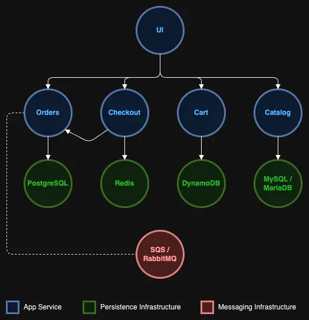

### Packaging the components

Before deploying to Kubernetes, each component must be built as a container image and published to a registry. The workshop provides prebuilt images in **Amazon ECR Public**, and the corresponding `Dockerfile` for each service.

| Component     | ECR Public repository                                                             | Dockerfile                                                                                                  |
| ------------- | --------------------------------------------------------------------------------- | ----------------------------------------------------------------------------------------------------------- |
| UI            | [Repository](https://gallery.ecr.aws/aws-containers/retail-store-sample-ui)       | [Dockerfile](https://github.com/aws-containers/retail-store-sample-app/blob/v1.2.1/src/ui/Dockerfile)       |
| Catalog       | [Repository](https://gallery.ecr.aws/aws-containers/retail-store-sample-catalog)  | [Dockerfile](https://github.com/aws-containers/retail-store-sample-app/blob/v1.2.1/src/catalog/Dockerfile)  |
| Shopping cart | [Repository](https://gallery.ecr.aws/aws-containers/retail-store-sample-cart)     | [Dockerfile](https://github.com/aws-containers/retail-store-sample-app/blob/v1.2.1/src/cart/Dockerfile)     |
| Checkout      | [Repository](https://gallery.ecr.aws/aws-containers/retail-store-sample-checkout) | [Dockerfile](https://github.com/aws-containers/retail-store-sample-app/blob/v1.2.1/src/checkout/Dockerfile) |
| Orders        | [Repository](https://gallery.ecr.aws/aws-containers/retail-store-sample-orders)   | [Dockerfile](https://github.com/aws-containers/retail-store-sample-app/blob/v1.2.1/src/orders/Dockerfile)   |

### Microservices on Kubernetes

Each service is deployed with core Kubernetes building blocks:
- **Pods** run the containers.
- **Deployments** manage replicas and scaling.
- **Services** provide stable discovery and networking.
- **StatefulSets** run stateful data stores (for example MySQL).
- **Namespaces** isolate each component and enable RBAC/network policy boundaries.

The **UI** calls downstream APIs across Services, while each microservice can have its own data store.

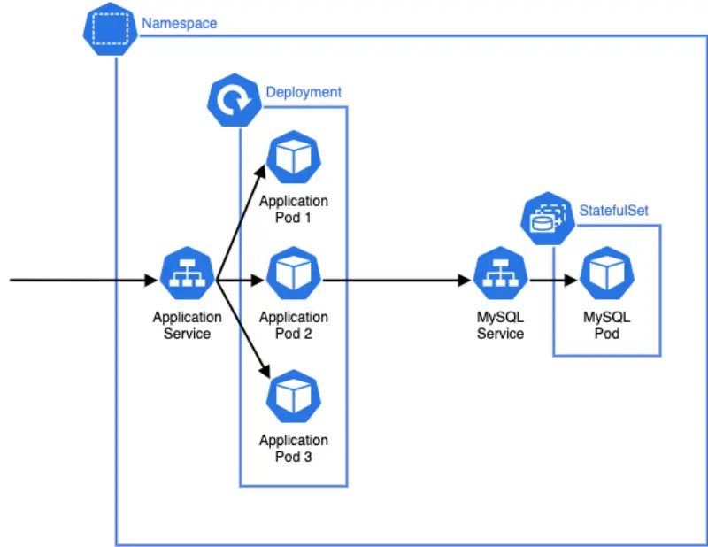

### Deploying our first component

The sample app is organized as Kubernetes manifests and applied using **Kustomize** (built into `kubectl`). You start by deploying only the **catalog** component.

Check Namespaces in EKS cluster:

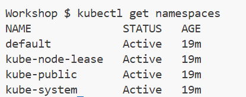

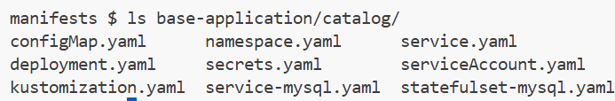

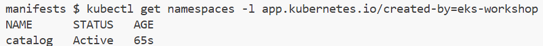
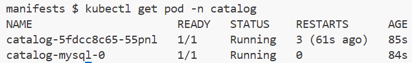
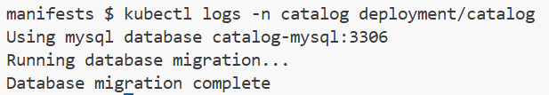
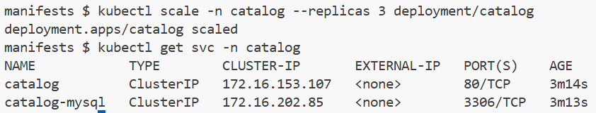
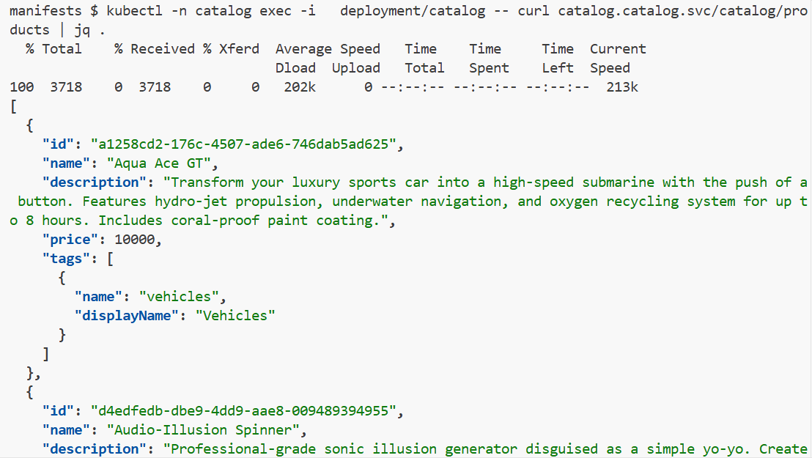
### Other components

After the catalog is running, deploy the rest of the application by applying the top-level **base-application** kustomization. Kubernetes will reconcile already-created resources without changes.

```bash
kubectl apply -k manifests/eks-workshop/base-application
kubectl wait --for=condition=Ready --timeout=180s pods \
  -l app.kubernetes.io/created-by=eks-workshop -A
```
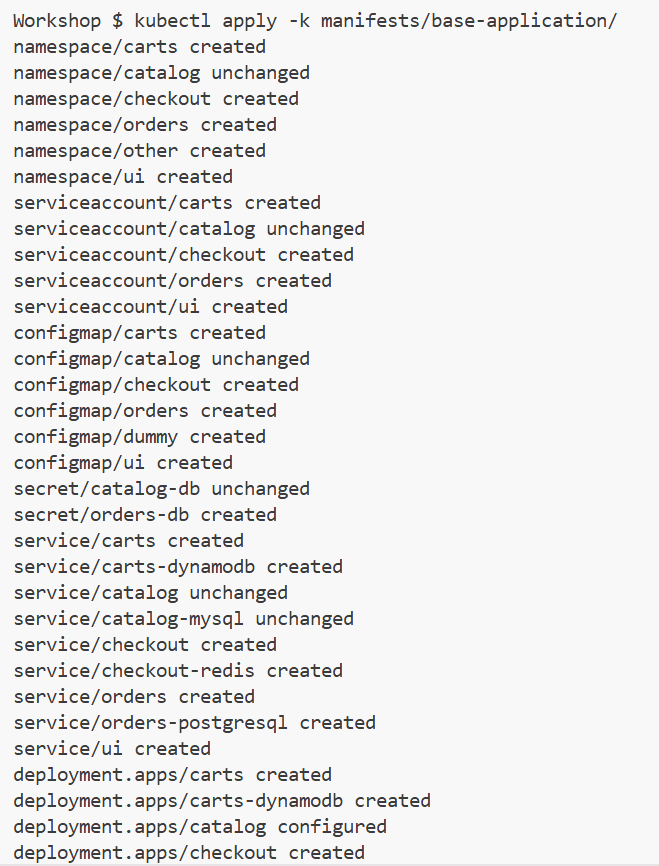
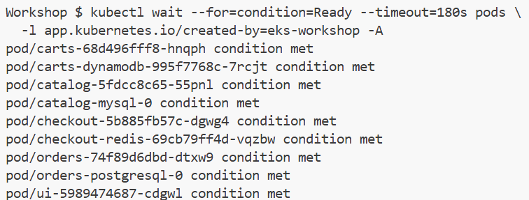
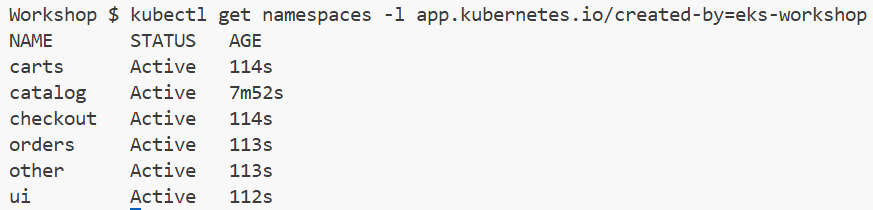


## Kustomize

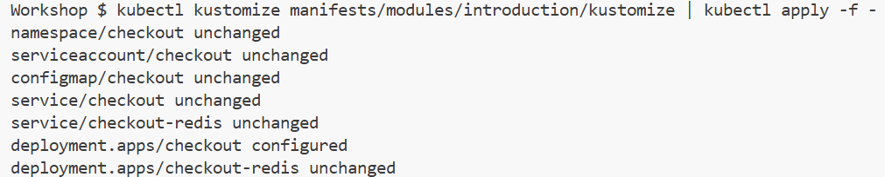
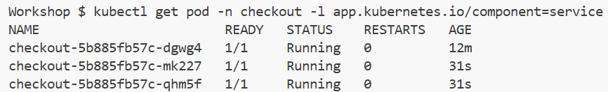
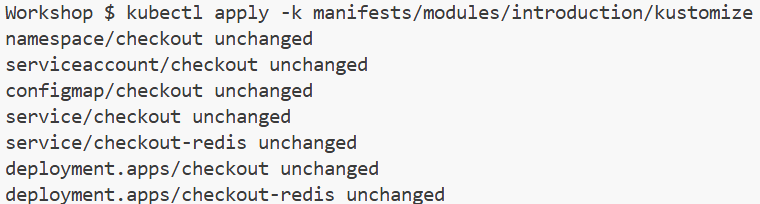
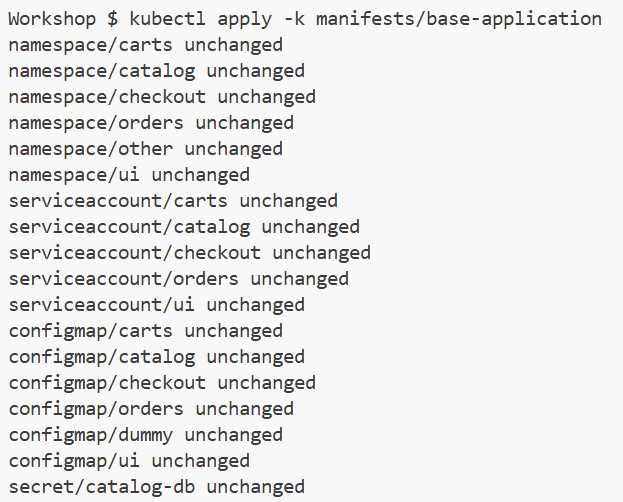
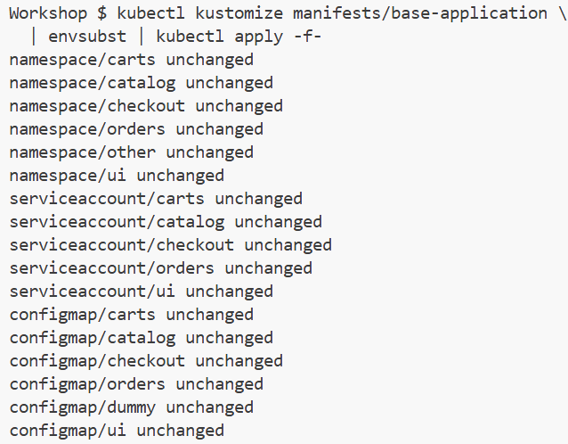
## Helm
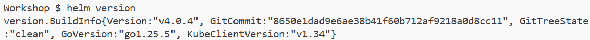
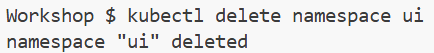
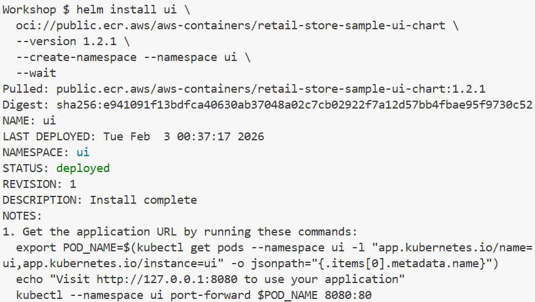
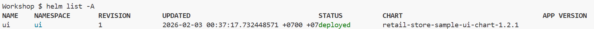
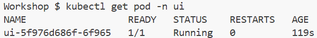

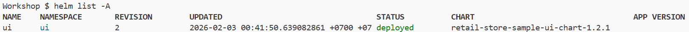
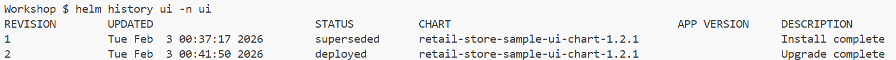
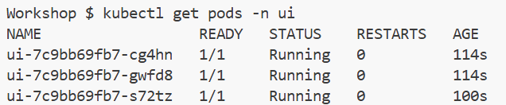
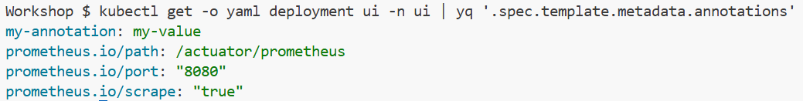
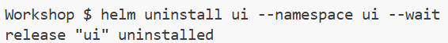
