# Introduction

## Overview

This EKS Workshop provides hands-on lab exercises to learn and explore Amazon EKS features and AWS service integrations. Choose any combination of modules based on your needs:

| Module         | Description                                           |
| -------------- | ----------------------------------------------------- |
| Introduction   | Workshop format and structure                         |
| Fundamentals   | Core EKS concepts (managed node groups, Fargate, etc) |
| Autoscaling    | Horizontal and vertical scaling                       |
| Observability  | Monitoring and operational insights                   |
| Security       | Container security practices                          |
| Networking     | EKS networking with Amazon VPC                        |
| Automation     | GitOps and infrastructure provisioning                |

---

## 1. Setup: Using eksctl

### Cluster Configuration

```yaml
apiVersion: eksctl.io/v1alpha5
kind: ClusterConfig
availabilityZones:
  - ${AWS_REGION}a
  - ${AWS_REGION}b
  - ${AWS_REGION}c
metadata:
  name: ${EKS_CLUSTER_NAME}
  region: ${AWS_REGION}
  version: "1.33"
  tags:
    karpenter.sh/discovery: ${EKS_CLUSTER_NAME}
    created-by: eks-workshop-v2
    env: ${EKS_CLUSTER_NAME}
iam:
  withOIDC: true
vpc:
  cidr: 10.42.0.0/16
  clusterEndpoints:
    privateAccess: true
    publicAccess: true
managedNodeGroups:
  - name: default
    desiredCapacity: 3
    minSize: 3
    maxSize: 6
    instanceType: m5.large
    privateNetworking: true
    releaseVersion: "1.33.0-20250704"
    updateConfig:
      maxUnavailablePercentage: 50
    labels:
      workshop-default: "yes"
addons:
  - name: vpc-cni
    version: 1.19.2
    configurationValues: '{"env":{"ENABLE_PREFIX_DELEGATION":"true", "ENABLE_POD_ENI":"true", "POD_SECURITY_GROUP_ENFORCING_MODE":"standard"},"enableNetworkPolicy": "true", "nodeAgent": {"enablePolicyEventLogs": "true"}}'
    resolveConflicts: overwrite
remoteNetworkConfig:
  remoteNodeNetworks:
    - cidrs: ["10.52.0.0/16"]
  remotePodNetworks:
    - cidrs: ["10.53.0.0/16"]
```

### Steps

**Step 1:** Set environment variables and create cluster
```bash
export EKS_CLUSTER_NAME=eks-workshop
export AWS_REGION=us-east-1
curl -fsSL https://raw.githubusercontent.com/aws-samples/eks-workshop-v2/stable/cluster/eksctl/cluster.yaml | \
envsubst | eksctl create cluster -f -
```

This process takes approximately 20 minutes.

---

## 2. Cleanup

**Step 1:** Remove sample application and lab infrastructure
```bash
delete-environment
```

**Step 2:** Delete the cluster
```bash
eksctl delete cluster $EKS_CLUSTER_NAME --wait
```

---

## 3. Sample Application

### Overview
The labs use a retail-store sample app with a UI and multiple backend services simulating a web store.

### Core Components

| Component | Description                                          |
| --------- | ---------------------------------------------------- |
| UI        | Web front end and API aggregator                     |
| Catalog   | Product listing and details API                      |
| Cart      | Shopping cart API                                    |
| Checkout  | Orchestrates checkout flow                           |
| Orders    | Receives and processes customer orders               |


### Container Images

All components are pre-built and available in Amazon ECR Public:

| Component     | ECR Public Repository                                                             |
| ------------- | --------------------------------------------------------------------------------- |
| UI            | [retail-store-sample-ui](https://gallery.ecr.aws/aws-containers/retail-store-sample-ui) |
| Catalog       | [retail-store-sample-catalog](https://gallery.ecr.aws/aws-containers/retail-store-sample-catalog) |
| Shopping Cart | [retail-store-sample-cart](https://gallery.ecr.aws/aws-containers/retail-store-sample-cart) |
| Checkout      | [retail-store-sample-checkout](https://gallery.ecr.aws/aws-containers/retail-store-sample-checkout) |
| Orders        | [retail-store-sample-orders](https://gallery.ecr.aws/aws-containers/retail-store-sample-orders) |

---

## 4. Microservices on Kubernetes

### Kubernetes Building Blocks

Each service uses standard Kubernetes resources:

- **Pods**: Run the containers
- **Deployments**: Manage replicas and scaling
- **Services**: Provide stable discovery and networking
- **StatefulSets**: Run stateful data stores (e.g., MySQL)
- **Namespaces**: Isolate components and enable RBAC/network policy

---

## 5. Deploying First Component

**Step 1:** Prepare environment
```bash
prepare-environment introduction/getting-started
```

**Step 2:** Check existing namespaces
```bash
kubectl get namespaces
kubectl get namespaces -l app.kubernetes.io/created-by=eks-workshop
```
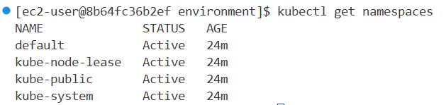
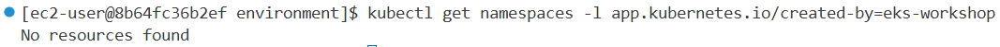

**Step 3:** Deploy catalog component
```bash
kubectl apply -k ~/environment/eks-workshop/base-application/catalog
```
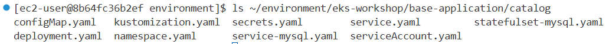

**Step 4:** Verify deployment
```bash
kubectl get namespaces -l app.kubernetes.io/created-by=eks-workshop
kubectl get pod -n catalog
```


---

## 6. Deploy All Components

**Step 1:** Apply base-application kustomization
```bash
kubectl apply -k ~/environment/eks-workshop/base-application
```
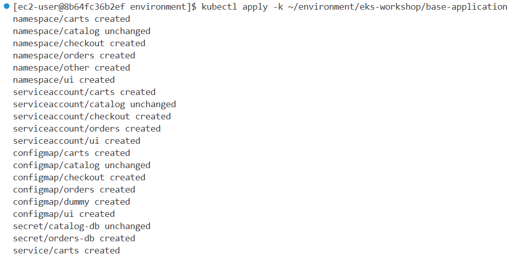
**Step 2:** Wait for all pods to be ready
```bash
kubectl wait --for=condition=Ready --timeout=180s pods \
  -l app.kubernetes.io/created-by=eks-workshop -A
```
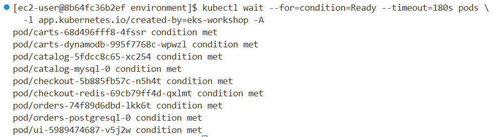
**Step 3:** Verify namespaces and deployments
```bash
kubectl get namespaces -l app.kubernetes.io/created-by=eks-workshop
kubectl get deployment -l app.kubernetes.io/created-by=eks-workshop -A
```
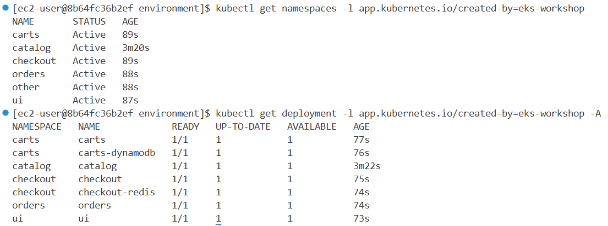

---

## 7. Kustomize

### Overview
Kustomize allows you to manage Kubernetes manifests using declarative "kustomization" files. It provides the ability to express "base" manifests and apply changes using composition and customization.

### Steps

**Step 1:** Prepare environment
```bash
prepare-environment
```

**Step 2:** Preview kustomization changes
```bash
kubectl kustomize ~/environment/eks-workshop/modules/introduction/kustomize
```

**Step 3:** Apply kustomization (scale checkout to 3 replicas)
```bash
kubectl kustomize ~/environment/eks-workshop/modules/introduction/kustomize | kubectl apply -f -
```

**Step 4:** Verify replicas
```bash
kubectl get pod -n checkout -l app.kubernetes.io/component=service
```
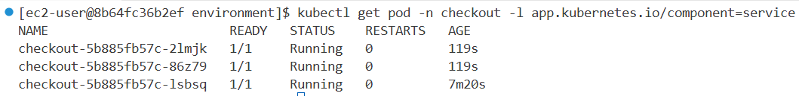

---

## 8. Helm

### Overview
Helm is a package manager for Kubernetes that uses charts to define, install, and upgrade applications. It simplifies deployment and management of applications on Kubernetes clusters.

### Steps

**Step 1:** Prepare environment
```bash
prepare-environment introduction/helm
```

**Step 2:** Check Helm version
```bash
helm version
```
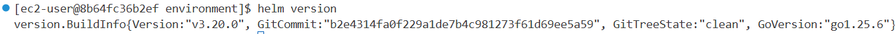
**Step 3:** Delete existing UI namespace
```bash
kubectl delete namespace ui
```
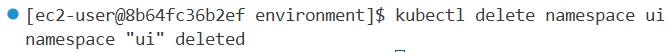
**Step 4:** Install UI using Helm chart
```bash
helm install ui \
  oci://public.ecr.aws/aws-containers/retail-store-sample-ui-chart \
  --version 1.2.1 \
  --create-namespace --namespace ui \
  --wait
```
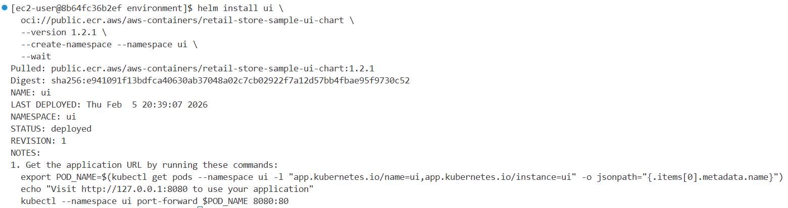
**Step 5:** List Helm releases
```bash
helm list -A
```
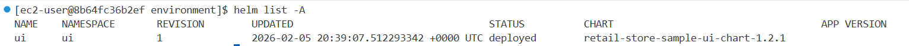
**Step 6:** Verify pods
```bash
kubectl get pod -n ui
```
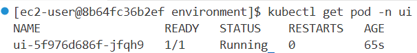

### Configuring Chart Options

**Step 7:** Upgrade with custom values
```bash
helm upgrade ui \
  oci://public.ecr.aws/aws-containers/retail-store-sample-ui-chart \
  --version 1.2.1 \
  --create-namespace --namespace ui \
  --set replicaCount=3 \
  --values ~/environment/eks-workshop/modules/introduction/helm/values.yaml \
  --wait
```
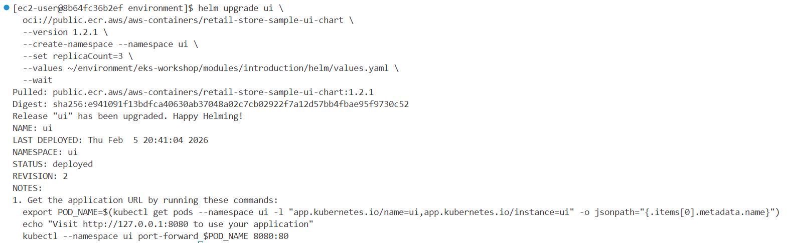
**Step 8:** Verify updated deployment
```bash
helm list -A
helm history ui -n ui
kubectl get pod -n ui
```
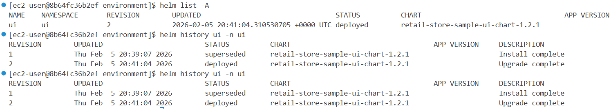

**Step 9:** Verify annotation was applied by inspecting the Deployment:
```bash
kubectl get -o yaml deployment ui -n ui | yq '.spec.template.metadata.annotations'
```

**Step 10: Removing releases:**
``` bash
helm uninstall ui --namespace ui --wait
```
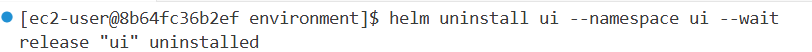
---
