# Observability

## Overview

Observability is a foundational element of a well-architected EKS environment. AWS provides native (CloudWatch) and open source managed (Amazon Managed Service for Prometheus, Amazon Managed Grafana and AWS Distro for OpenTelemetry) solutions for monitoring, logging and alarming of EKS environments.


---

## 1. Resource View in EKS Console

### Overview
View all Kubernetes API resource types using the AWS Management Console for Amazon EKS, including configuration, authorization, policy, and service resources.

### Resources

**Step 1:** Prepare environment
```bash
prepare-environment
```


**Step 2:** Access EKS Console
- Navigate to AWS Management Console → EKS
- Select your cluster `eks-workshop`
- View the Observability tab

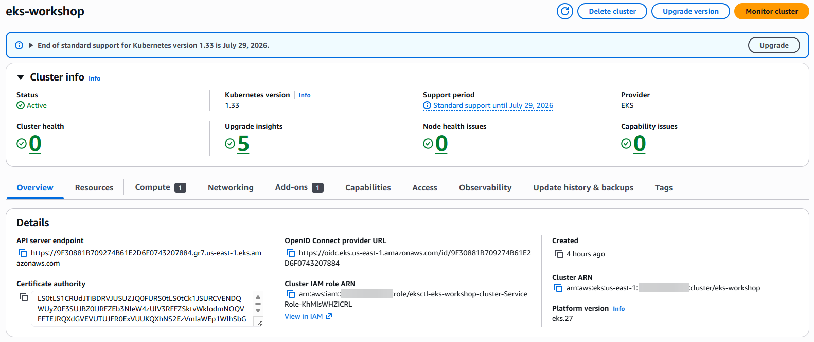

**Step 3:** Explore resource views
- Pods (catalog)

- ReplicaSet

- Deployment
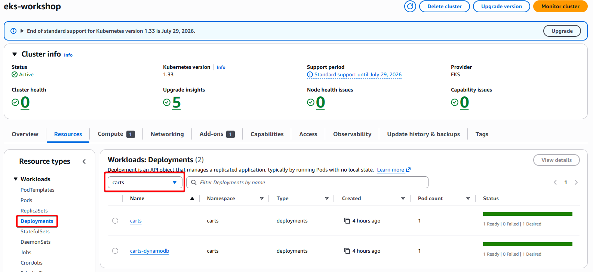
- DaemonSet

- Cluster view - overall cluster health and metrics
    - Nodes
  
  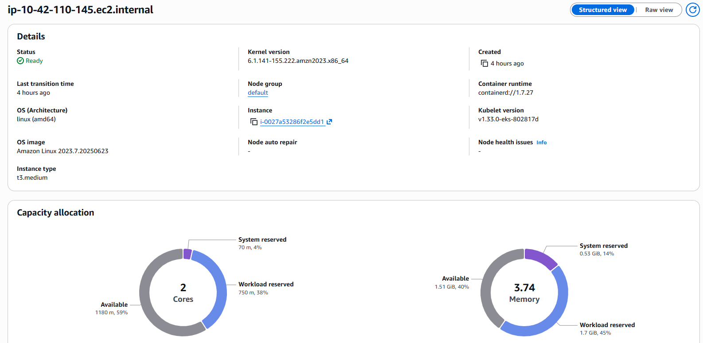
    - Namespaces

- Services and Endpoints
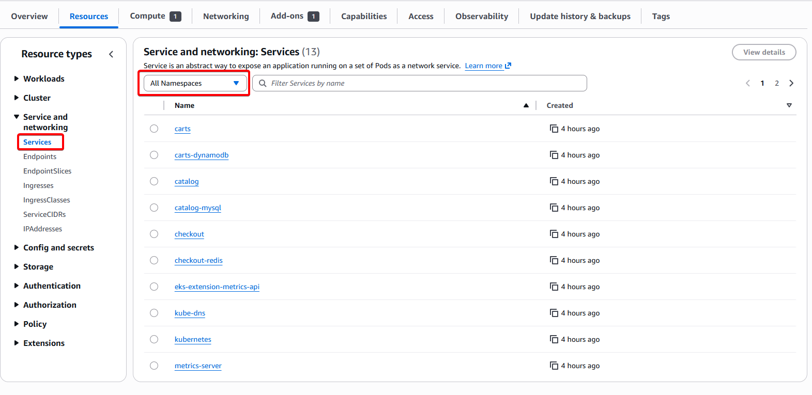
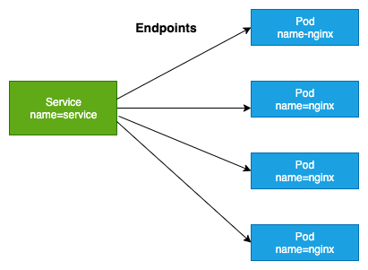
- ConfigMaps and Secrets
  - ConfigMaps
  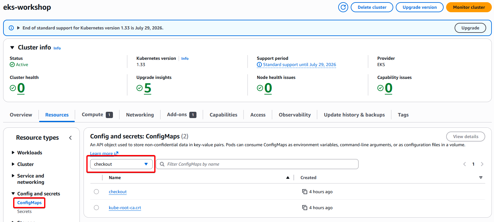
  - Secrets
  
- Storage
- Authentication and Authorization
  - Service Account


  - Role
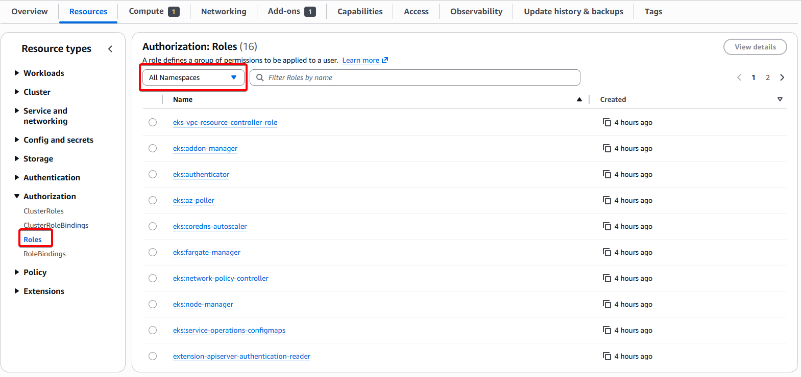
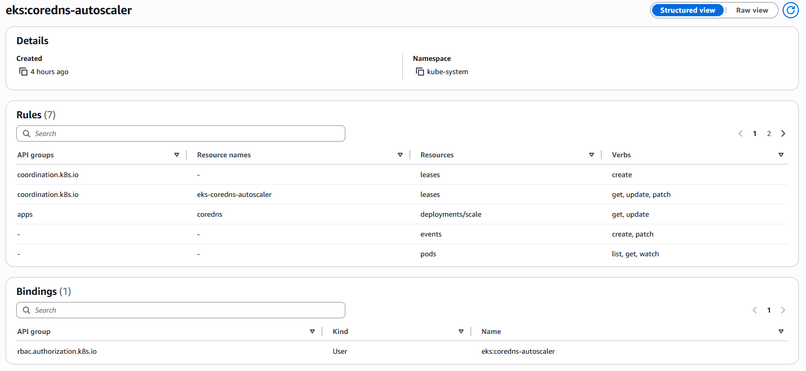
  - ClusterRoles
  - Role binding
  - ClusterRoleBinding

- Policy
  - Policies
  - LimitRange
  - Resource Quotas
  - NetworkPolicy
  - Pod Disruption Budget


- CustomResourceDefinitions


### Add-ons


### Observability
    
    
    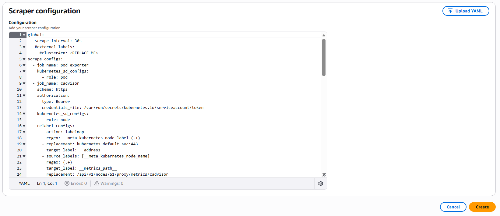
    
    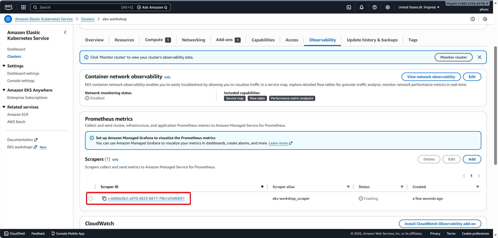
---

## 2. Logging in EKS

### 2.1 Control Plane Logging

EKS control plane logging captures logs from API server, audit, authenticator, controller manager, and scheduler components.\n\n**Configuring control plane logs:**\n\nThe Logging tab shows the current configuration for control plane logs for the cluster:

You can alter the logging configuration by clicking the Manage button:


The Logging tab shows the current configuration for control plane logs for the cluster:
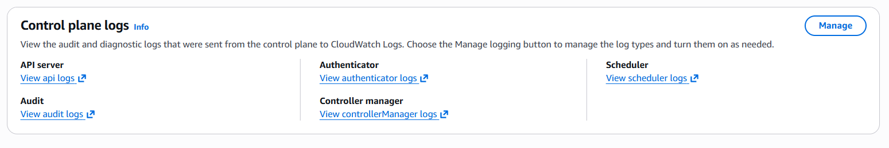\n\n**Viewing in CloudWatch:**\n\nFilter for /aws/eks prefix and select the cluster you want verify the logs:
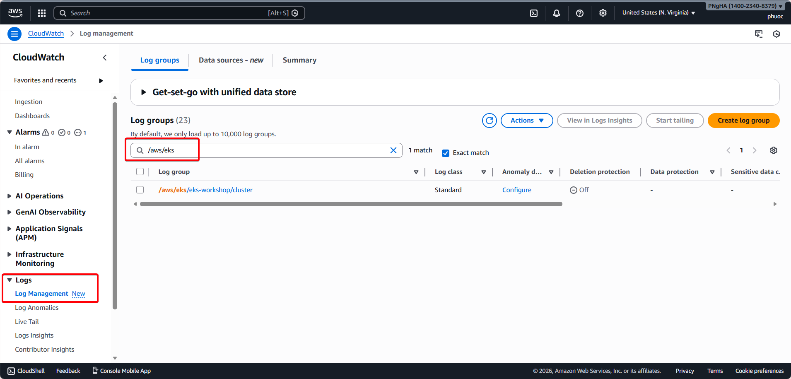
You will be presented with a number of log streams in the group:
\n\n**CloudWatch Log Insights:**\n\nYou will be presented with a screen that looks like this:

In the Log Insights console select the log group for your EKS cluster:
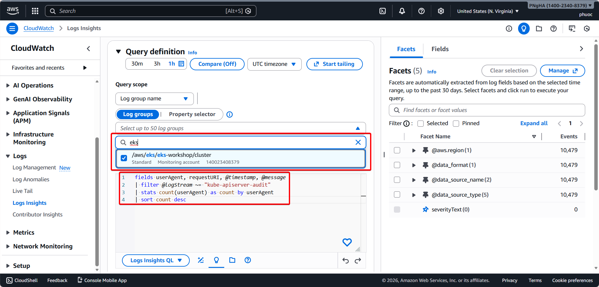
Copy the query to the console and press Run query, which will return results:


### 2.2 Pod Logging with Fluent Bit

Fluent Bit is a lightweight log processor deployed as a DaemonSet to collect and forward container logs from `/var/log/containers/*.log` to CloudWatch Logs.


**Step 1:** Verify Fluent Bit DaemonSet
```bash
kubectl get all -n kube-system -l app.kubernetes.io/name=aws-for-fluent-bit
```

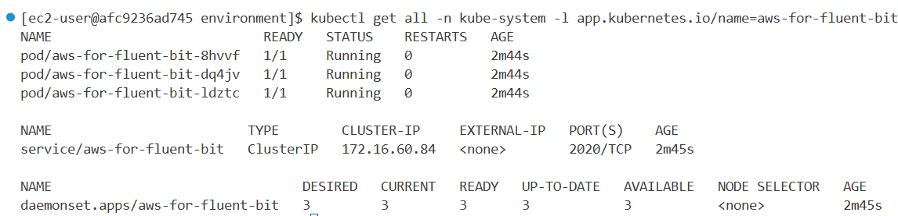

**Step 2:** Check Fluent Bit configuration
```bash
kubectl describe configmap -n kube-system -l app.kubernetes.io/name=aws-for-fluent-bit
```
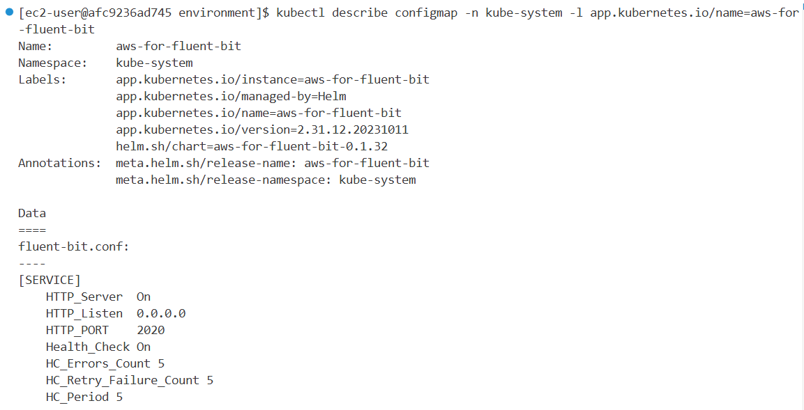
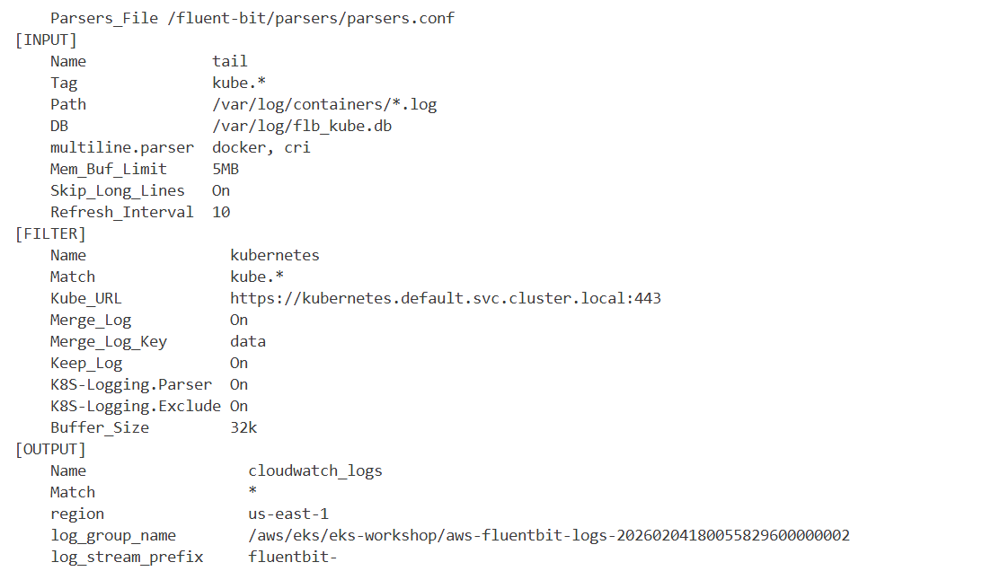
**Step 3:** Verify Fluent Bit logs
```bash
kubectl logs daemonset.apps/aws-for-fluent-bit -n kube-system
```


**Step 4:** Access CloudWatch Logs
- First, lets recycle the pods for the ui component to make sure fresh logs are written since we enabled Fluent Bit:
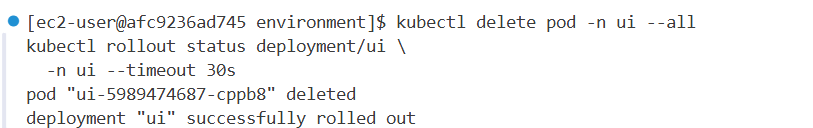
- Now we can check that our ui component is creating logs by directly using kubectl logs:
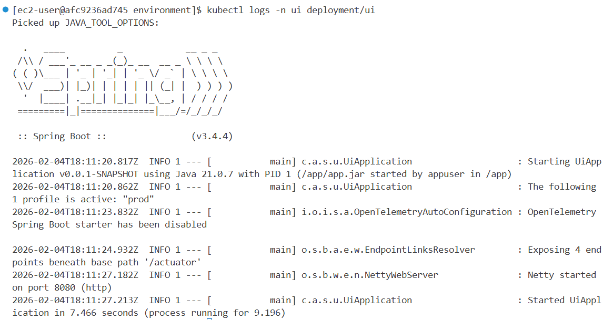
- Navigate to CloudWatch Console → Log groups
- Find log group: `/aws/eks/eks-workshop/aws-fluentbit-logs-*`
- Explore log streams prefixed with `fluentbit-`
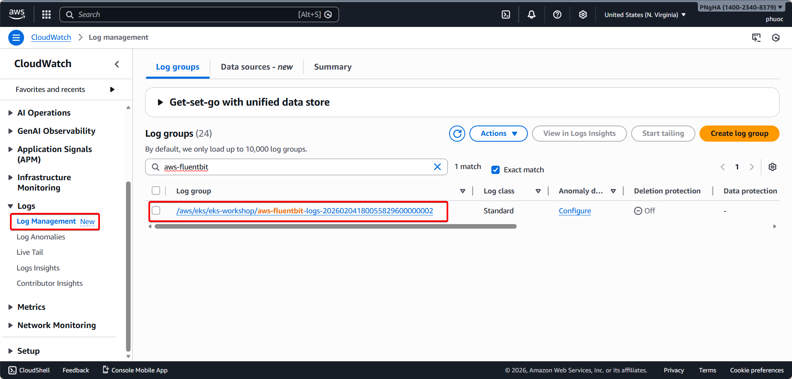
**Step 5:** Use CloudWatch Logs Insights
- Select the Fluent Bit log group

- Expand one of the log entries to see the full JSON payload
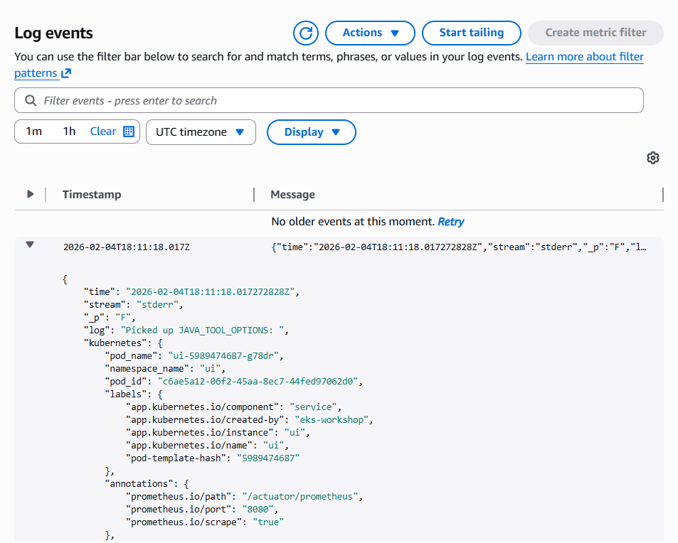
---

## 3. Container Insights

### Overview
CloudWatch Container Insights collects, aggregates, and summarizes metrics and logs from containerized applications using AWS Distro for OpenTelemetry (ADOT).

Prepare environment:

``` bash
prepare-environment observability/container-insights
```

This will make the following changes to your lab environment:

- Install the OpenTelemetry operator
- Create an IAM role for the ADOT collector to access CloudWatch

### 3.1 Cluster metrics

**Step 1:** Review collector manifest
The OpenTelemetry collector runs as a DaemonSet (one pod per node) to collect telemetry from nodes and container runtime.

Key components:
- **AWS Container Insights Receiver**: Collects metrics from nodes
- **Batch Processor**: Buffers metrics and flushes every 60 seconds
- **AWS CloudWatch EMF Exporter**: Converts metrics to CloudWatch Embedded Metric Format

**Step 2:** Verify IAM role for the collector
```bash
aws iam list-attached-role-policies \
  --role-name eks-workshop-adot-collector-ci | jq .
```

The collector uses `CloudWatchAgentServerPolicy` managed policy via IRSA.

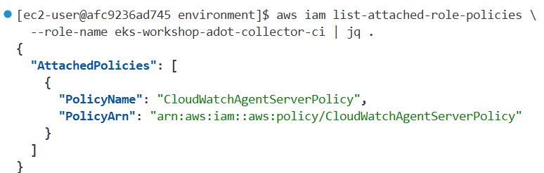

**Step 3:** Deploy the ADOT Collector DaemonSet
```bash
kubectl kustomize ~/environment/eks-workshop/modules/observability/container-insights/adot \
  | envsubst | kubectl apply -f- && sleep 5
kubectl rollout status -n other daemonset/adot-container-ci-collector --timeout=120s
```

**Step 4:** Verify collector pods are running
```bash
kubectl get pod -n other -l app.kubernetes.io/name=adot-container-ci-collector
```

**Step 5:** View metrics in CloudWatch Container Insights
- Navigate to CloudWatch Console → Container Insights
- Select your EKS cluster `eks-workshop`
- Explore metrics by cluster, namespace, or pod

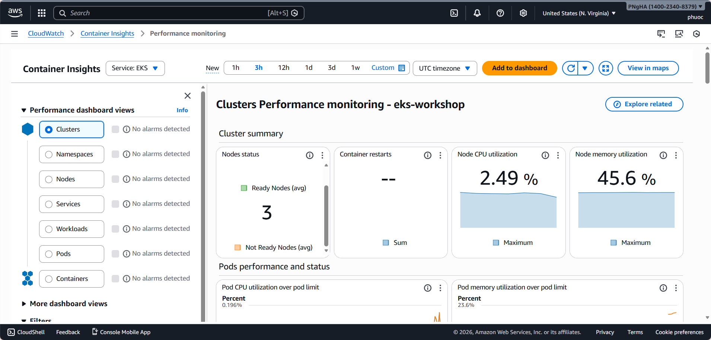

> Note: It may take a few minutes for data to appear in CloudWatch.

### 3.2 Using CloudWatch Logs Insights

Container Insights stores performance log events in CloudWatch Logs using Embedded Metric Format. Use CloudWatch Logs Insights to analyze this data.

**Step 1:** Open CloudWatch Logs Insights Console
- Navigate to CloudWatch Console → Logs → Logs Insights

**Step 2:** Select log group
- Choose the log group ending with `/performance` for your EKS cluster

**Step 3:** Query average CPU utilization by node
```sql
STATS avg(node_cpu_utilization) as avg_node_cpu_utilization by NodeName
| SORT avg_node_cpu_utilization DESC
```


**Step 4:** Query container restarts by pod
```sql
STATS avg(number_of_container_restarts) as avg_number_of_container_restarts by PodName
| SORT avg_number_of_container_restarts DESC
```


### 3.3 Application Metrics

Collect application-specific metrics (Java heap, database connections, business KPIs) using Prometheus receiver and visualize in CloudWatch.

**Step 1:** View application metrics endpoint
```bash
kubectl -n orders exec deployment/orders -- curl http://localhost:8080/actuator/prometheus
```

Example metrics:
- `jdbc_connections_idle` - Database connection pool status
- `watch_orders_total` - Business metric for orders placed


**Step 2:** Deploy ADOT Collector as Deployment (for pod metrics scraping)
```bash
kubectl kustomize ~/environment/eks-workshop/modules/observability/container-insights/adot-deployment \
  | envsubst | kubectl apply -f- && sleep 5
kubectl rollout status -n other deployment/adot-container-ci-deploy-collector --timeout=120s
```
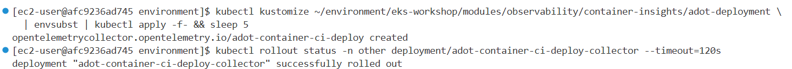

**Step 3:** Verify collector is running
```bash
kubectl get pod -n other -l app.kubernetes.io/name=adot-container-ci-deploy-collector
```
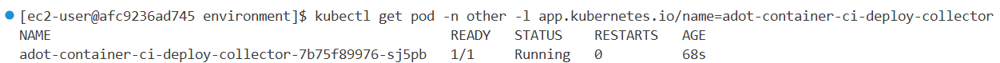
**Step 4:** Generate load to create metrics
```bash
cat <<EOF | kubectl apply -f -
apiVersion: v1
kind: Pod
metadata:
  name: load-generator
  namespace: other
spec:
  containers:
  - name: artillery
    image: artilleryio/artillery:2.0.0-31
    args:
    - "run"
    - "-t"
    - "http://ui.ui.svc"
    - "/scripts/scenario.yml"
    volumeMounts:
    - name: scripts
      mountPath: /scripts
  initContainers:
  - name: setup
    image: public.ecr.aws/aws-containers/retail-store-sample-utils:load-gen.1.2.1
    command: ["bash"]
    args: ["-c", "cp /artillery/* /scripts"]
    volumeMounts:
    - name: scripts
      mountPath: "/scripts"
  volumes:
  - name: scripts
    emptyDir: {}
EOF
```
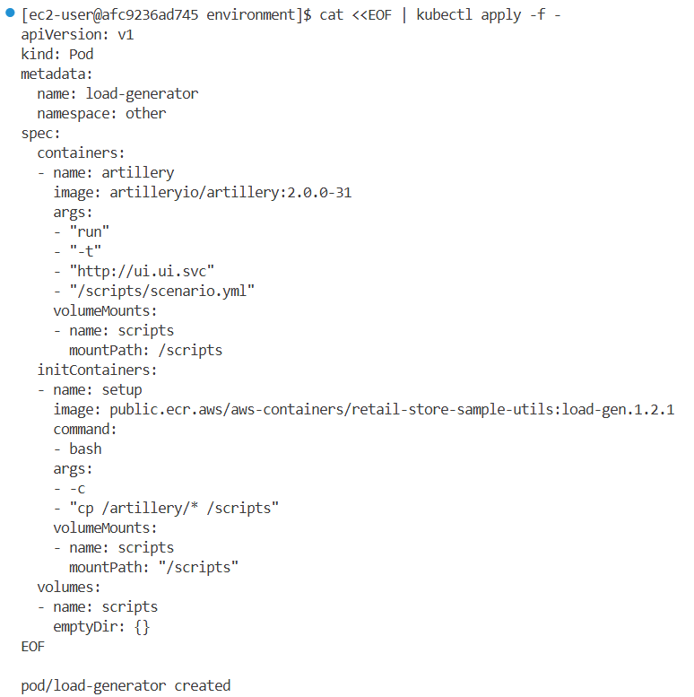

**Step 5:** View dashboard in CloudWatch
- Navigate to CloudWatch Console → Dashboards
- Select `Order-Service-Metrics` dashboard

- View "Orders by Product" panel with query:
```sql
SELECT COUNT(watch_orders_total) FROM "ContainerInsights/Prometheus" WHERE productId != '*' GROUP BY productId
```


**Step 6:** Cleanup load generator
```bash
kubectl delete pod load-generator -n other
```
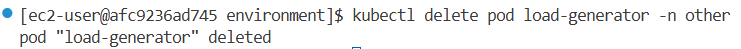

---

## 4. Open Source Observability (Prometheus & Grafana)

### Overview
Use AWS Distro for OpenTelemetry (ADOT) to collect metrics, Amazon Managed Service for Prometheus (AMP) to store them, and Amazon Managed Grafana (AMG) to visualize.

**Step 1:** Prepare environment
```bash
prepare-environment observability/oss-metrics
```

This creates:
- OpenTelemetry operator
- IAM role for ADOT with AMP permissions
- AMP workspace

**Step 2:** Verify AMP workspace
```bash
aws amp list-workspaces
```

Or visit AMP Console to see workspace starting with `eks-workshop`

**Step 3:** Deploy ADOT Collector for Prometheus
```bash
kubectl kustomize ~/environment/eks-workshop/modules/observability/oss-metrics/adot \
  | envsubst | kubectl apply -f-
kubectl rollout status -n other deployment/adot-collector --timeout=120s
```

**Step 4:** Verify collector configuration
```bash
kubectl -n other get opentelemetrycollector adot -o yaml
```

The collector uses:
- Prometheus receiver to scrape metrics
- Prometheus remote write exporter to send to AMP

**Step 5:** Verify metrics ingestion in AMP
```bash
awscurl -X POST --region $AWS_REGION --service aps \
  "${AMP_ENDPOINT}api/v1/query?query=up" | jq
```

**Step 6:** Access Amazon Managed Grafana
- Navigate to AMG Console
- Select workspace for `eks-workshop`
- Click "Grafana workspace URL"
- Login with AWS SSO or IAM

**Step 7:** Configure AMP as data source
1. In Grafana: Configuration → Data Sources
2. Add data source → Prometheus
3. URL: Your AMP workspace query endpoint
4. Authentication: SigV4
5. Save & Test

**Step 8:** Import Kubernetes dashboards
- Import dashboard ID: 3119 (Kubernetes cluster monitoring)
- Import dashboard ID: 6417 (Kubernetes deployment metrics)
- Select AMP data source


**Step 9:** Create custom dashboards
- Monitor application-specific metrics
- Create alerts based on Prometheus queries
- Visualize custom business metrics


---

## 5. OpenSearch for Observability

Use Amazon OpenSearch Service to ingest, search, visualize and analyze Kubernetes events, control plane logs, and pod logs.

**Prepare environment:**
```bash
prepare-environment observability/opensearch
```

This will make the following changes to your lab environment:
- Cleanup resources from earlier EKS workshop modules
- Provision an Amazon OpenSearch Service domain (see note below)
- Setup Lambda function that is used to export EKS control plane logs from CloudWatch Logs to OpenSearch

Note: OpenSearch domain provisioning takes ~30 minutes

### 5.1 Access OpenSearch

Credentials for the OpenSearch domain have been saved in the AWS Systems Manager Parameter Store during the provisioning process. Retrieve this information and set up the necessary environment variables:


Load pre-created OpenSearch dashboards to display Kubernetes events and pods logs. The dashboards are available in the file which includes the OpenSearch index patterns, visualizations and dashboards for Kubernetes events and pod logs.


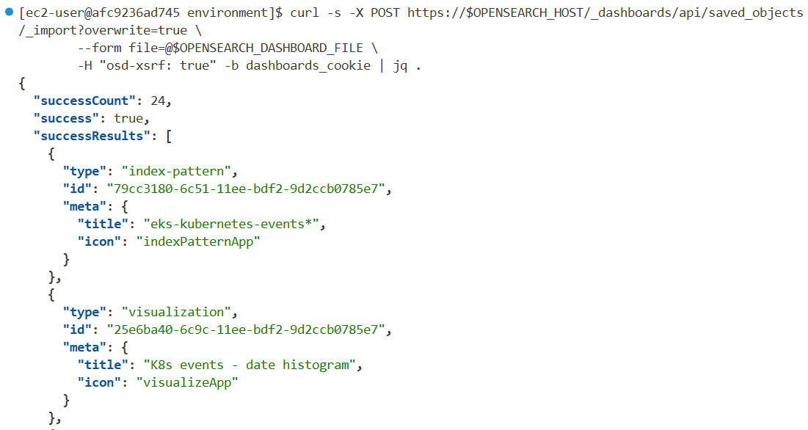

View the OpenSearch server coordinates and credentials that we retrieved earlier and confirm that the OpenSearch dashboards are accessible.


Point your browser to the OpenSearch dashboard URL above and use the credentials to login.


Select the Global tenant as shown below. Tenants in OpenSearch can be used to safely share resources such as index patterns, visualizations and dashboards.


You should see the two dashboards (for Kubernetes events and pod logs) that were loaded in the earlier step. The dashboards are currently empty since there is no data in OpenSearch yet. Keep this browser tab open or save the dashboard URLs. We will return to the dashboards in the next sections.


### 5.2 Kubernetes Events
The following diagram provides an overview of the setup for this section. kubernetes-events-exporter will be deployed in the opensearch-exporter namespace to forward events to the OpenSearch domain. Events are stored in the eks-kubernetes-events index in OpenSearch. An OpenSearch dashboard that we loaded earlier is used to visualize the events.

Deploy Kubernetes events exporter and configure it to send events to our OpenSearch domain. The base configuration is available here. The OpenSearch credentials we retrieved earlier are being used to configure the exporter. The second command verifies that the Kubernetes events pod is running.

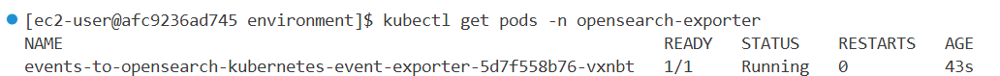
Now we'll generate additional Kubernetes events by launching three deployments labelled scenario-a, scenario-b and scenario-c within the test namespace to demonstrate Normal and Warning events. Each deployment intentionally includes an error.
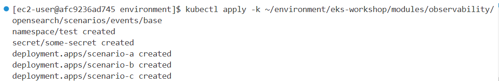
Explore the OpenSearch Kubernetes events dashboard by returning to the OpenSearch dashboard that we used in the previous page. Access the Kubernetes events dashboard from the dashboard landing page we saw earlier or use the command below to obtain its coordinates:
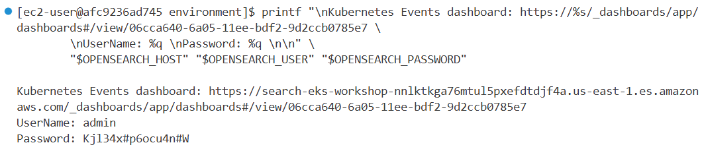
The live dashboard should look similar to the image below but the numbers and messages will vary depending on cluster activity. An explanation of the dashboards sections and fields follows.

1. [Header] Shows date / time range. We can customize the time range that we are exploring with this dashboard (Last 30 minutes in this example)
2. [Top section] Date histogram of events (split between Normal and Warning events)
3. [Middle section] Kubernetes events shows the total number of events (Normal and Warning)
4. [Middle section] Warning events seen during the selected time interval.
5. [Middle section] Warnings broken out by namespace. All the warnings are in the test namespace in this example
6. [Bottom section] Detailed events and messages with most recent event first


The next image focuses on the bottom section with event details including:

1. Last timestamp for the event
2. Event type (normal or warning). Notice that hovering our mouse over a field enables us to filter by that value (e.g. filter for Warning events)
3. Name of Kubernetes resource (along with the object type and namespace)
4. Human readable message

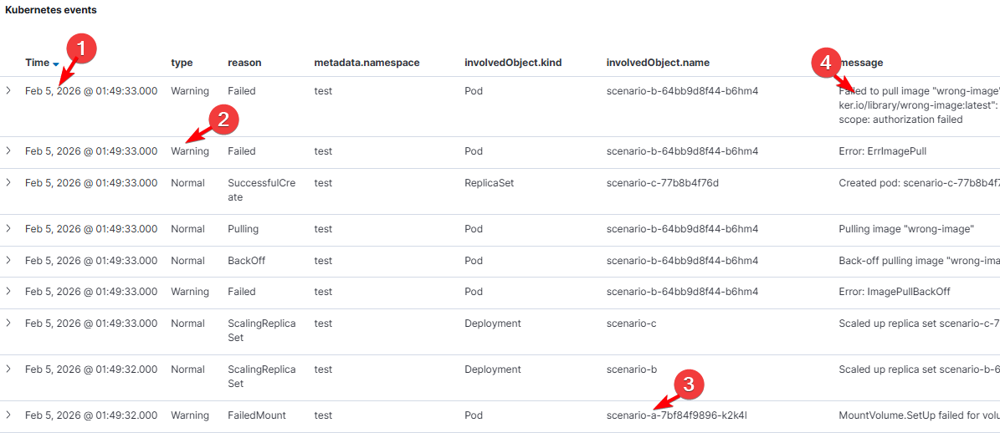
We can drill down into the full event details as shown in the following image:

1. Clicking on the '>' next to each event opens up a new section
2. The full event document can be viewed as a table or in JSON format
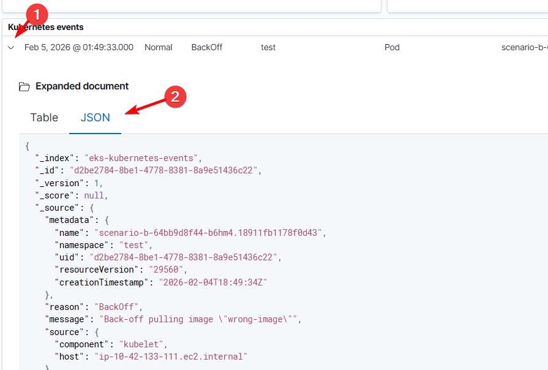

We can use the Kubernetes events dashboard to identify why the three deployments (scenario-a, scenario-b and scenario-c) are experiencing issues. All the pods we deployed earlier are in the test namespace.

- scenario-a: From the dashboard we can see that scenario-a has a reason of FailedMount and the message MountVolume.SetUp failed for volume "secret-volume" : secret "misspelt-secret-name" not found. The pod is attempting to mount a secret that does not exist.
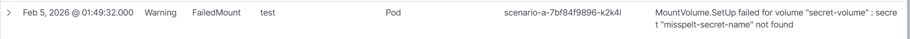
- scenario-b: scenario-b has failed with a message Failed to pull image "wrong-image": rpc error: code = Unknown desc = failed to pull and unpack image "docker.io/library/wrong-image:latest": failed to resolve reference "docker.io/library/wrong-image:latest": pull access denied, repository does not exist or may require authorization: server message: insufficient_scope: authorization failed. The pod is not getting created because it references a non-existent image.


Fix the issues and revisit OpenSearch dashboard to see changes
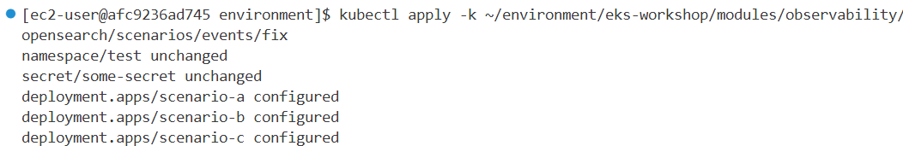

Retrieve the five most recent events in the cluster.
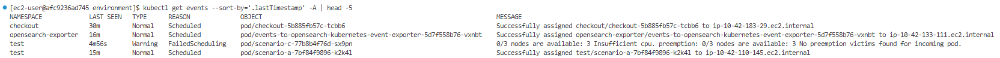
See events with a warning or failed status.
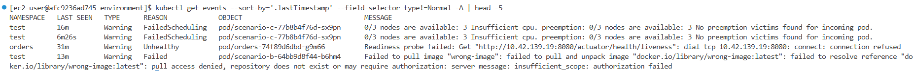
See the most recent event (across all namespaces) in JSON format. Notice that the output is very similar to the details found within the OpenSearch index. (The Opensearch document has additional fields to facilitate indexing within OpenSearch).


### 5.3 Control Plane Logs

**Overview:**
Amazon EKS control plane logging provides audit and diagnostic logs directly from the Amazon EKS control plane to CloudWatch Logs. This section demonstrates forwarding these logs from CloudWatch Logs to OpenSearch using a Lambda function.

There are five types of control plane logs available:
- **API server (api)**: Kubernetes API server component logs that expose the Kubernetes API
- **Audit (audit)**: Records of individual users, administrators, or system components that have affected your cluster
- **Authenticator (authenticator)**: EKS-specific logs for RBAC authentication using IAM credentials
- **Controller manager (controllerManager)**: Manages core control loops shipped with Kubernetes
- **Scheduler (scheduler)**: Manages when and where to run pods in your cluster

**Architecture:**
The following diagram shows the flow from left to right:
1. Control plane logs are enabled in Amazon EKS, which sends logs to CloudWatch Logs
2. A CloudWatch Logs subscription filter triggers a Lambda function and sends it the log messages
3. The Lambda function writes the control plane logs to an OpenSearch index
4. A single OpenSearch index named `eks-control-plane-logs` stores all the control plane logs


**Step 1:** Enable EKS control plane logging
```bash
aws eks update-cluster-config \
  --region $AWS_REGION \
  --name $EKS_CLUSTER_NAME \
  --logging '{"clusterLogging":[{"types":["api","audit","authenticator","controllerManager","scheduler"],"enabled":true}]}'
```


**Step 2:** Wait for cluster to become active
```bash
sleep 30
aws eks wait cluster-active --name $EKS_CLUSTER_NAME
```

**Step 3:** Verify logging configuration in EKS Console
Navigate to EKS Console → Clusters → eks-workshop → Logging tab to verify all five log types are enabled.
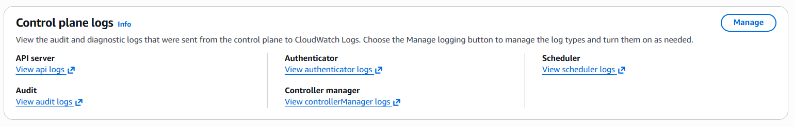
**Step 4:** Access CloudWatch Logs
Navigate to CloudWatch Console and access log group `/aws/eks/eks-workshop/cluster`. You will find log streams for each control plane component:
- `kube-apiserver-*` for Kubernetes API server logs
- `*-audit-*` for audit logs
- `authenticator-*` for authenticator logs
- `kube-controller-manager-*` for controller manager logs
- `kube-scheduler-*` for scheduler logs

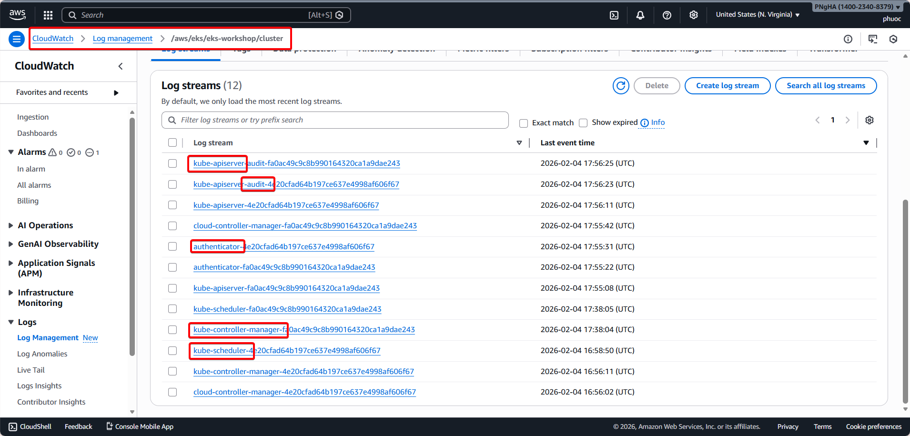
**Step 5:** Review Lambda function
A Lambda function named `eks-workshop-control-plane-logs` was pre-provisioned to export logs. Currently, it has no triggers configured.
**Step 6:** Get Lambda function details
```bash
echo $LAMBDA_ARN
echo $LAMBDA_ROLE_ARN
```
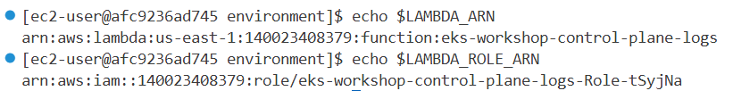
**Step 7:** Create OpenSearch role for Lambda
Grant the Lambda function permissions to create and write to the OpenSearch index:
```bash
curl -s -XPUT "https://${OPENSEARCH_HOST}/_plugins/_security/api/roles/lambda_role" \
  -u $OPENSEARCH_USER:$OPENSEARCH_PASSWORD -H 'Content-Type: application/json' \
  --data-raw '{"cluster_permissions": ["*"], "index_permissions": [{"index_patterns": ["eks-control-plane-logs*"], "allowed_actions": ["*"]}]}' \
  | jq .
```

**Step 8:** Create role mapping
Map the Lambda function's execution role to the OpenSearch role:
```bash
curl -s -XPUT "https://${OPENSEARCH_HOST}/_plugins/_security/api/rolesmapping/lambda_role" \
  -u $OPENSEARCH_USER:$OPENSEARCH_PASSWORD -H 'Content-Type: application/json' \
  --data-raw '{"backend_roles": ["'"$LAMBDA_ROLE_ARN"'"]}' | jq .
```
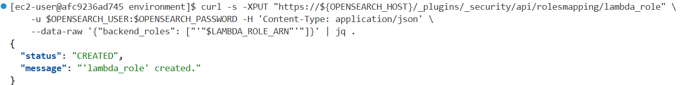
**Step 9:** Create CloudWatch Logs subscription filter
Configure the subscription filter to trigger the Lambda function:
```bash
aws logs put-subscription-filter \
  --log-group-name /aws/eks/$EKS_CLUSTER_NAME/cluster \
  --filter-name "${EKS_CLUSTER_NAME}-Control-Plane-Logs-To-OpenSearch" \
  --filter-pattern "" \
  --destination-arn $LAMBDA_ARN
```
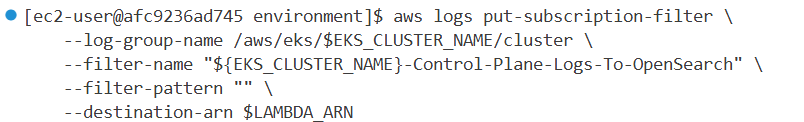
**Step 10:** Verify subscription filter
```bash
aws logs describe-subscription-filters \
  --log-group-name /aws/eks/$EKS_CLUSTER_NAME/cluster | jq .
```


**Step 11:** Verify Lambda trigger
Return to Lambda Console and check the `eks-workshop-control-plane-logs` function. CloudWatch Logs should now appear as a trigger.

**Step 12:** Access Control Plane Logs Dashboard
```bash
printf "\nControl Plane logs dashboard: https://%s/_dashboards/app/dashboards#/view/1a1c3a70-831a-11ee-8baf-a5d5c77ada98 \
  \nUserName: %q \nPassword: %q \n\n" \
  "$OPENSEARCH_HOST" "$OPENSEARCH_USER" "$OPENSEARCH_PASSWORD"
```

**Step 13:** Explore the dashboard
The dashboard provides:
1. Date/time range selector (default: Last hour)
2. Message count per minute histogram for each log type
3. Detailed log messages for each component
4. Log stream field matching CloudWatch log stream names
5. Separate panels for all five control plane log types:
   - API Server logs
   - Audit logs
   - Authenticator logs
   - Controller Manager logs
   - Scheduler logs


### 5.4 Pod Logging

**Overview:**
Export pod logs to OpenSearch using AWS for Fluent Bit. Fluent Bit collects logs from `/var/log/pods/*.log` on each node and forwards them to OpenSearch for centralized analysis.

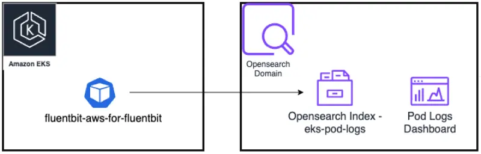

**Step 1:** Add Helm repo and deploy Fluent Bit
```bash
helm repo add eks https://aws.github.io/eks-charts
helm upgrade fluentbit eks/aws-for-fluent-bit --install \
  --namespace opensearch-exporter --create-namespace \
  -f ~/environment/eks-workshop/modules/observability/opensearch/config/fluentbit-values.yaml \
  --set="opensearch.host"="$OPENSEARCH_HOST" \
  --set="opensearch.awsRegion"=$AWS_REGION \
  --set="opensearch.httpUser"="$OPENSEARCH_USER" \
  --set="opensearch.httpPasswd"="$OPENSEARCH_PASSWORD" \
  --wait
```

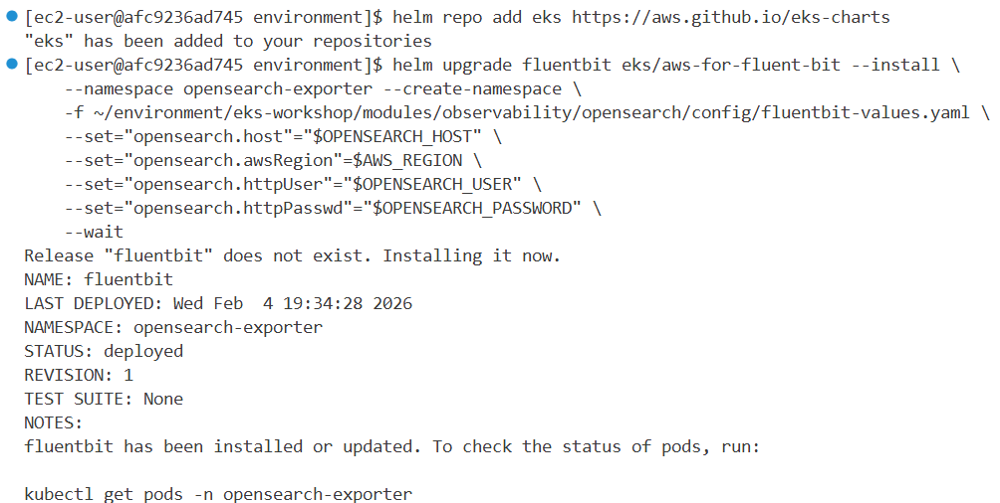
**Step 2:** Verify Fluent Bit DaemonSet (one pod per node)
```bash
kubectl get daemonset -n opensearch-exporter
```

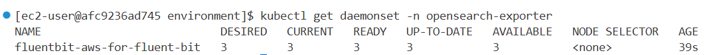

**Step 3:** Recycle UI pods to generate fresh logs
```bash
kubectl delete pod -n ui --all
kubectl rollout status deployment/ui -n ui --timeout 30s
```
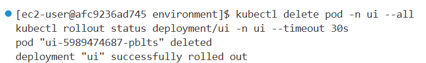
**Step 4:** Verify logs with kubectl
```bash
kubectl logs -n ui deployment/ui
```
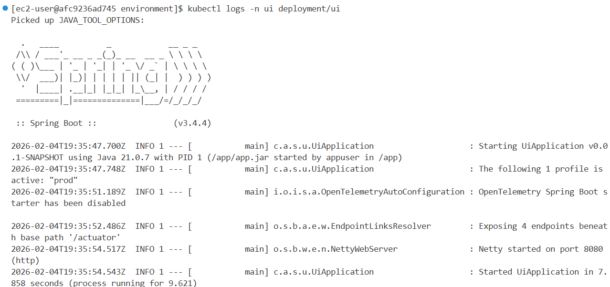

**Step 5:** Access Pod Logs Dashboard in OpenSearch
```bash
printf "\nPod logs dashboard: https://%s/_dashboards/app/dashboards#/view/31a8bd40-790a-11ee-8b75-b9bb31eee1c2 \
  \nUserName: %q \nPassword: %q \n\n" \
  "$OPENSEARCH_HOST" "$OPENSEARCH_USER" "$OPENSEARCH_PASSWORD"
```

**Step 6:** Explore the dashboard

Dashboard sections:
1. **Header**: Date/time range selector
2. **Top section**: Histogram showing `stdout` vs `stderr` streams
3. **Middle section**: Log distribution across namespaces
4. **Bottom section**: Detailed log entries with pod name, namespace, and messages
5. **Bottom section**: Log messages gathered from the individual pods.


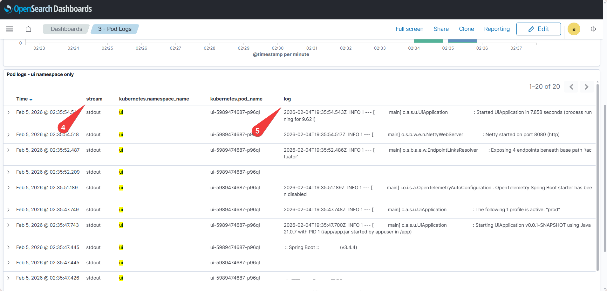
**Step 7:** Drill down into log details
- Click '>' next to any log entry
- View full JSON payload including:
  - `log`: The actual log message
  - Pod metadata (name, namespace, labels)
  - Timestamp and stream type

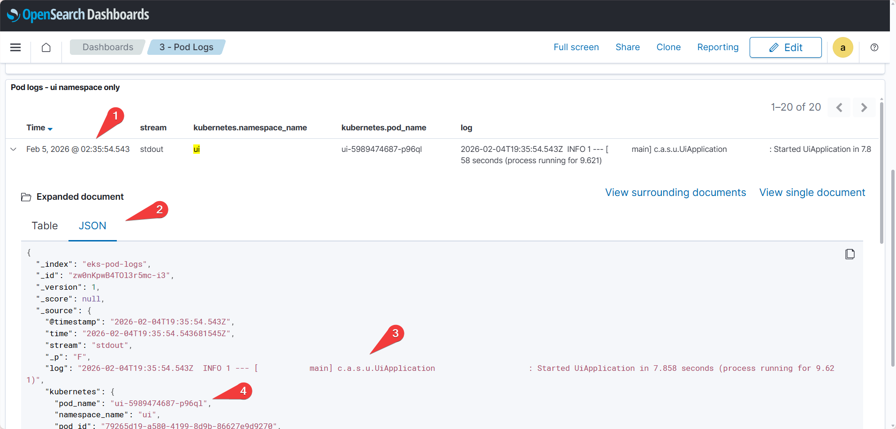

---

## 6. Cost Visibility with Kubecost

### Overview
Kubecost provides real-time cost visibility and insights for Kubernetes resources, helping track costs by namespace, cluster, pod, or organizational concepts.

**Step 1:** Prepare environment
```bash
prepare-environment observability/kubecost
```

This installs:
- AWS Load Balancer controller
- EBS CSI driver addon

**Step 2:** Install Kubecost
```bash
aws ecr-public get-login-password \
  --region us-east-1 | helm registry login \
  --username AWS \
  --password-stdin public.ecr.aws
helm upgrade --install kubecost oci://public.ecr.aws/kubecost/cost-analyzer \
  --version "${KUBECOST_CHART_VERSION}" \
  --namespace "kubecost" --create-namespace \
  --values https://raw.githubusercontent.com/kubecost/cost-analyzer-helm-chart/v${KUBECOST_CHART_VERSION}/cost-analyzer/values-eks-cost-monitoring.yaml \
  --values ~/environment/eks-workshop/modules/observability/kubecost/values.yaml \
  --wait
```
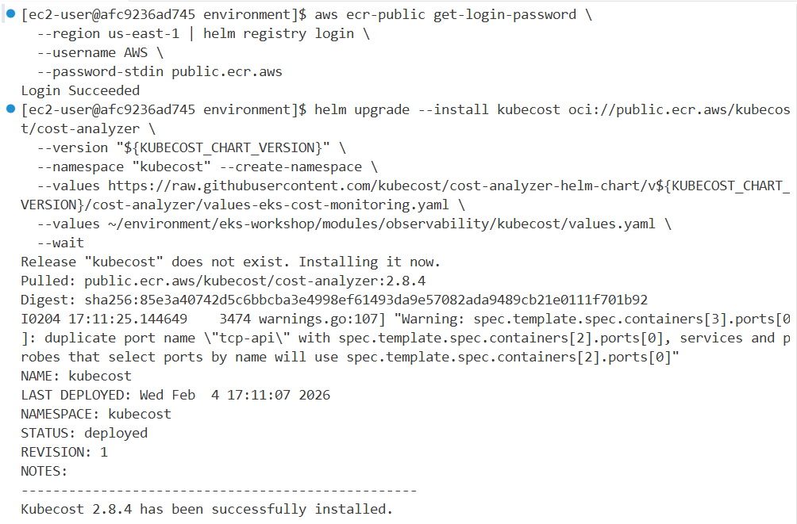

Check if Kubecost is running:
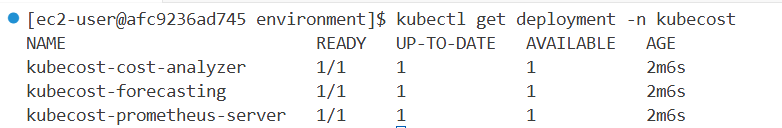
**Step 3:** Access Kubecost dashboard
```bash
export KUBECOST_SERVER=$(kubectl get svc -n kubecost kubecost-cost-analyzer -o json | jq --raw-output '.status.loadBalancer.ingress[0].hostname'):9090
echo "Kubecost URL: http://$KUBECOST_SERVER"
```

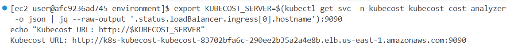
The load balancer will take some time to provision so use this command to wait until Kubecost responds:
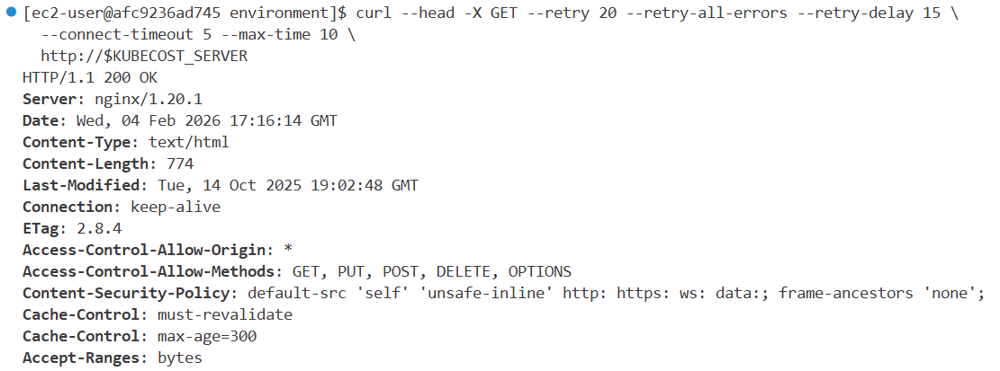
Open the URL in your browser to access Kubecost:
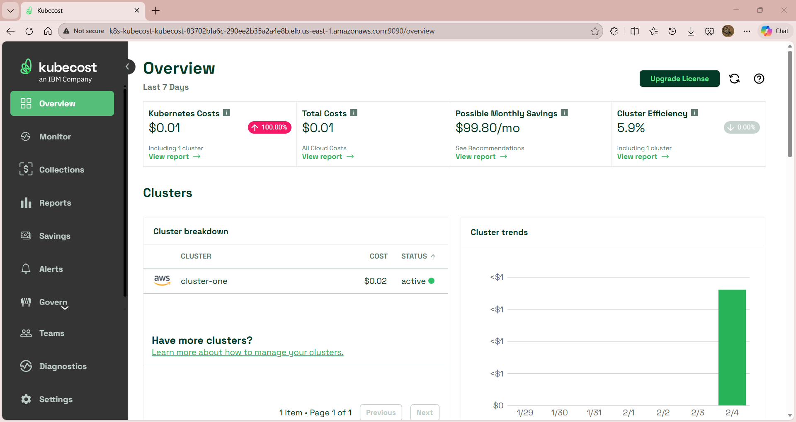

**Step 4:** View cost allocation
- Overview dashboard shows total cluster costs
- Break down by namespace, deployment, pod
- View cost trends over time

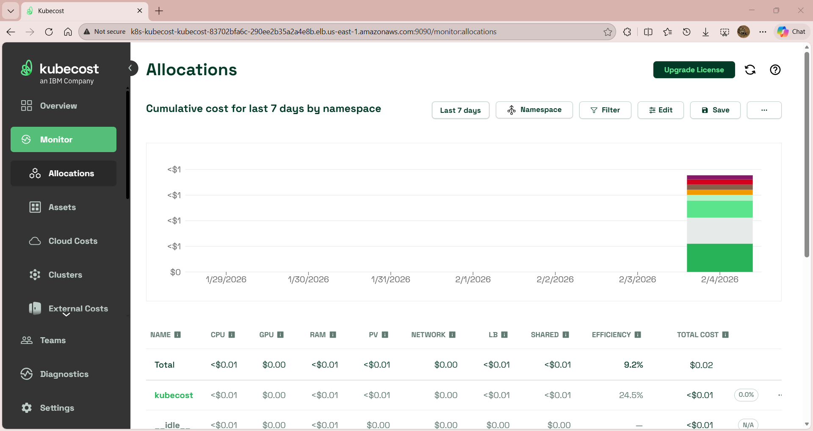
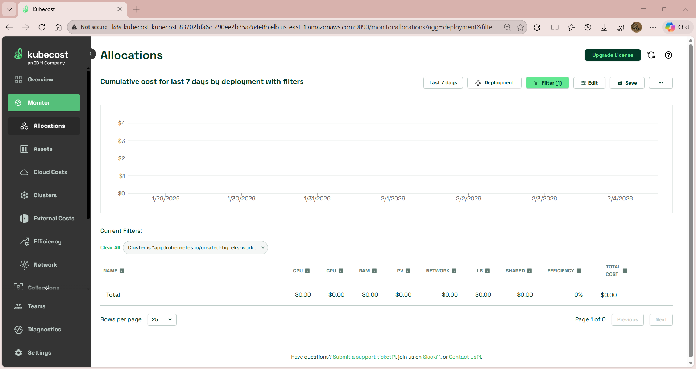
**Step 5:** Analyze efficiency
- Resource efficiency metrics (CPU, memory utilization)
- Identify over-provisioned workloads
- Right-sizing recommendations

**Step 6:** Configure alerts
- Set budget limits per namespace
- Alert on cost anomalies
- Schedule cost reports

**Step 7:** Integrate with Amazon Managed Prometheus
- Configure Kubecost to use AMP
- Enable multi-cluster cost monitoring
- Centralize cost data across clusters


---
