# EKS Security Guide

## Overview

Security at AWS is the highest priority, and is a shared responsibility between AWS and customers. When using a managed service like Amazon EKS, AWS is responsible for security "of" the cloud whereas you, the customer, are responsible for security "in" the cloud.


---

## 1. Amazon EKS Pod Identity

### Overview
EKS Pod Identities provide the ability to manage AWS credentials for applications, similar to how Amazon EC2 Instance Profiles provide credentials to instances. Instead of creating and distributing AWS credentials to containers, you associate an IAM role with a Kubernetes Service Account.

### Prepare Environment
```bash
prepare-environment security/eks-pod-identity
```

This creates:
- Amazon DynamoDB table
- IAM role for EKS workloads
- AWS Load Balancer Controller

### Amazon EKS Pod Identity
#### Introduction
1. Check carts pod:
``` bash
kubectl -n carts get pod
```

2. Verify carts application is using
``` bash
kubectl -n carts exec deployment/carts -- env | grep RETAIL_CART_PERSISTENCE_DYNAMODB_ENDPOINT
```

#### Using Amazon DynamoDB
1. re-configure the carts service to use a DynamoDB table

2.  check the current status of the application using the browser

3.  open the Retail Store

4.  check the value of CARTS_DYNAMODB_TABLENAME then run Kustomize to use the real DynamoDB service:

5.  This will overwrite our ConfigMap with new values:

6.  recycle all the carts pods to pick up our new ConfigMap contents:

7.  It looks like our change failed to deploy properly. We can confirm this by looking at the Pods:

#### Understanding Pod IAM

#### Using EKS Pod Identity
**Step 1:** Install EKS Pod Identity Agent addon
```bash
aws eks create-addon --cluster-name $EKS_CLUSTER_NAME --addon-name eks-pod-identity-agent
aws eks wait addon-active --cluster-name $EKS_CLUSTER_NAME --addon-name eks-pod-identity-agent
```

**Step 2:** Verify Pod Identity Agent DaemonSet
```bash
kubectl -n kube-system get daemonset eks-pod-identity-agent
kubectl -n kube-system get pods -l app.kubernetes.io/name=eks-pod-identity-agent
```

**Step 3:** View IAM policy for DynamoDB access
```bash
aws iam get-policy-version \
  --version-id v1 --policy-arn \
  --query 'PolicyVersion.Document' \
  arn:aws:iam::${AWS_ACCOUNT_ID}:policy/${EKS_CLUSTER_NAME}-carts-dynamo | jq .
```

**Step 4:** Verify trust relationship (EKS Service Principal)
```bash
aws iam get-role \
  --query 'Role.AssumeRolePolicyDocument' \
  --role-name ${EKS_CLUSTER_NAME}-carts-dynamo | jq .
```

**Step 5:** Create Pod Identity association
```bash
aws eks create-pod-identity-association \
  --cluster-name $EKS_CLUSTER_NAME \
  --namespace carts \
  --service-account carts \
  --role-arn arn:aws:iam::${AWS_ACCOUNT_ID}:role/${EKS_CLUSTER_NAME}-carts-dynamo
```

**Step 6:** Restart pods to pick up new identity
```bash
kubectl rollout restart -n carts deployment/carts
kubectl rollout status -n carts deployment/carts --timeout=60s
```


---
#### Verifying DynamoDB access
1. Now, with the carts Service Account associated with the authorized IAM role, the carts Pod has permission to access the DynamoDB table. Access the web store again and navigate to the shopping cart.

2. Now cart can be access

3. After the AWS IAM role is associated with the Service Account, any newly created Pods using that Service Account will be intercepted by the EKS Pod Identity webhook. This webhook runs on the Amazon EKS cluster's control plane and is fully managed by AWS. Take a closer look at the new carts Pod to see the new environment variables:


Notable points about these environment variables:

- AWS_DEFAULT_REGION - The region is set automatically to the same as our EKS cluster
- AWS_STS_REGIONAL_ENDPOINTS - Regional STS endpoints are configured to avoid putting too much pressure on the global endpoint in us-east-1
- AWS_CONTAINER_CREDENTIALS_FULL_URI - This variable tells AWS SDKs how to obtain credentials using the HTTP credential provider. This means that EKS Pod Identity does not need to inject credentials via something like an AWS_ACCESS_KEY_ID/AWS_SECRET_ACCESS_KEY pair, and instead the SDKs can have temporary credentials vended to them via the EKS Pod Identity mechanism. You can read more about how this functions in the AWS documentation.

## 2. Amazon GuardDuty for EKS

### Overview
Amazon GuardDuty offers threat detection enabling you to continuously monitor and protect your AWS accounts, workloads, and data. GuardDuty has two categories of protection for EKS:
1. **EKS Audit Log Monitoring** - Detects potentially suspicious activities using Kubernetes audit logs
2. **EKS Runtime Monitoring** - Provides runtime threat detection for Amazon EKS nodes and containers

### Enable GuardDuty Protection on EKS

**Step 1:** Enable GuardDuty using AWS CLI
```bash
aws guardduty create-detector --enable --features '[{"Name" : "EKS_AUDIT_LOGS", "Status" : "ENABLED"}, {"Name" : "EKS_RUNTIME_MONITORING", "Status" : "ENABLED", "AdditionalConfiguration" : [{"Name" : "EKS_ADDON_MANAGEMENT", "Status" : "ENABLED"}]}]'
```

**Step 2:** Validate GuardDuty agent deployment (after several minutes)
```bash
kubectl -n amazon-guardduty get pods
```


**Step 3:** Navigate to GuardDuty Findings console to verify no findings yet


---

### EKS Audit Log Monitoring

EKS Audit Log Monitoring analyzes Kubernetes audit logs to detect potentially malicious activities.

#### 1. Unsafe Execution in kube-system Namespace
Generates finding: `Execution:Kubernetes/ExecInKubeSystemPod`

1. Create a Pod in kube-system namespace:
```bash
kubectl -n kube-system run nginx --image=nginx
kubectl wait --for=condition=ready pod nginx -n kube-system
```

2. Execute command inside the Pod to trigger finding:
```bash
kubectl -n kube-system exec nginx -- pwd
```
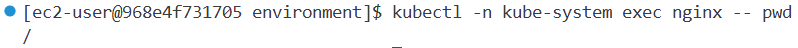
3. Check GuardDuty console for `Execution:Kubernetes/ExecInKubeSystemPod` finding

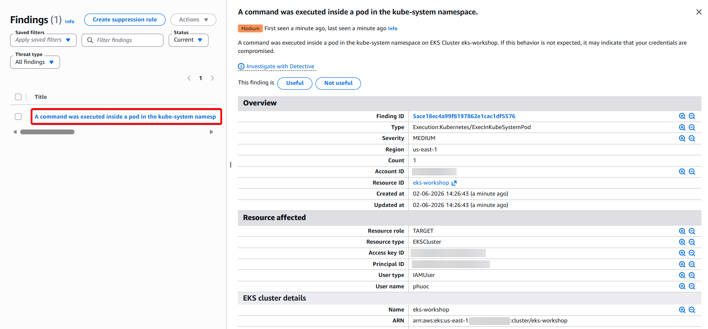

4. Cleanup:
```bash
kubectl -n kube-system delete pod nginx
```
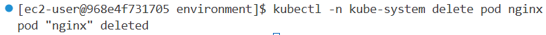
#### 2. Admin Access to Default Service Account
Generates finding: `Policy:Kubernetes/AdminAccessToDefaultServiceAccount`

1. Bind cluster-admin role to default Service Account:
```bash
kubectl -n default create rolebinding sa-default-admin --clusterrole cluster-admin --serviceaccount default:default
```
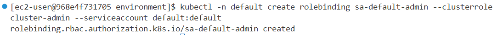
2. Check GuardDuty console for the finding
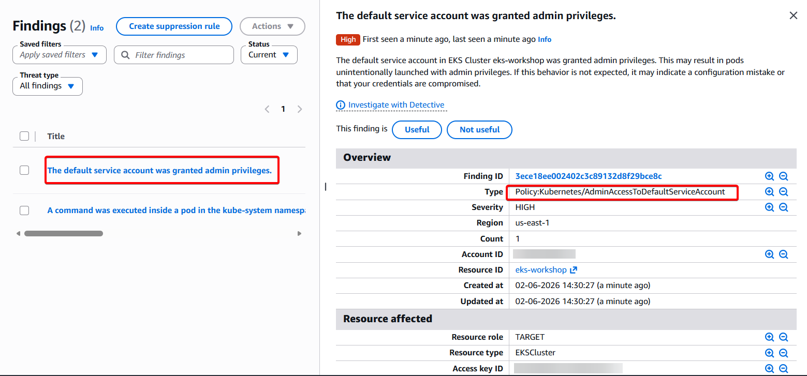
3. Cleanup:
```bash
kubectl -n default delete rolebinding sa-default-admin
```
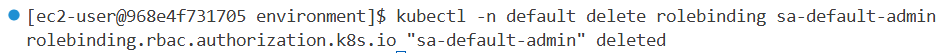
#### 3. Exposed Kubernetes Dashboard
Generates finding: `Policy:Kubernetes/ExposedDashboard`

1. Install Kubernetes dashboard:
```bash
kubectl apply -f https://raw.githubusercontent.com/kubernetes/dashboard/v2.7.0/aio/deploy/recommended.yaml
kubectl -n kubernetes-dashboard rollout status deployment/kubernetes-dashboard
```

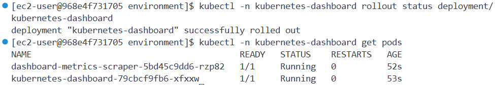

2. Expose dashboard via LoadBalancer:
```bash
kubectl -n kubernetes-dashboard patch svc kubernetes-dashboard -p='{"spec": {"type": "LoadBalancer"}}'
```
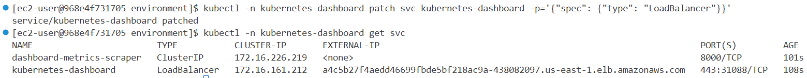

3. Check GuardDuty console for `Policy:Kubernetes/ExposedDashboard` finding


4. Cleanup:
```bash
kubectl delete -f https://raw.githubusercontent.com/kubernetes/dashboard/v2.7.0/aio/deploy/recommended.yaml
```

#### 4. Privileged Container with Sensitive Mount
Generates findings: `PrivilegeEscalation:Kubernetes/PrivilegedContainer` and `Persistence:Kubernetes/ContainerWithSensitiveMount`

1. Apply privileged Pod manifest (with `securityContext: privileged: true` and host `/etc` mount):
```bash
kubectl apply -f ~/environment/eks-workshop/modules/security/Guardduty/mount/privileged-pod-example.yaml
```
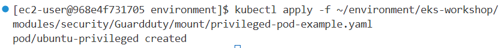

2. Check GuardDuty console for both findings


3. Cleanup:
```bash
kubectl delete -f ~/environment/eks-workshop/modules/security/Guardduty/mount/privileged-pod-example.yaml
```
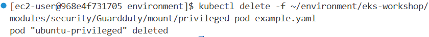

---

### EKS Runtime Monitoring

EKS Runtime Monitoring uses the GuardDuty security agent to detect threats at the operating system level (file access, process execution, network connections).

#### 5. Crypto Currency Mining Detection
Generates findings: `Execution:Runtime/NewBinaryExecuted` and `CryptoCurrency:Runtime/BitcoinTool.B!DNS`

1. Create a Pod for simulation:
```bash
kubectl run crypto -n other --image ubuntu --restart=Never --command -- sleep infinity
kubectl wait --for=condition=ready pod crypto -n other
```

2. Install curl utility (triggers `NewBinaryExecuted`):
```bash
kubectl exec crypto -n other -- bash -c 'apt update && apt install -y curl'
```
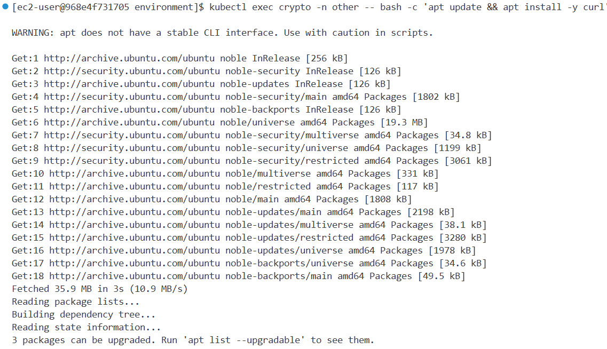
3. Simulate crypto mining connection (triggers `BitcoinTool.B!DNS`):
```bash
kubectl exec crypto -n other -- bash -c 'curl -s -o /dev/null http://us-east.equihash-hub.miningpoolhub.com:12026 || true'
```
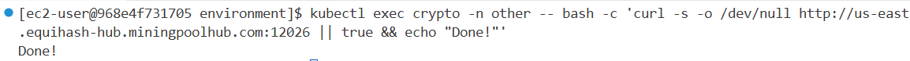

4. Check GuardDuty console for runtime findings with detailed process and DNS information

---

### Cleanup GuardDuty

To disable GuardDuty, run:
```bash
aws guardduty list-detectors --output text --query DetectorIds | xargs aws guardduty delete-detector --detector-id
```


## 3. Cluster Access Management API

### Overview
The Cluster Access Management API simplifies identity mapping between AWS IAM and Kubernetes RBAC. It enables administrators to leverage IAM security features (audit logging, MFA) by mapping IAM to Kubernetes identities directly through EKS API.

### Key Concepts

**Access Entries (Authentication):** Cluster identities linked to AWS IAM principals (users or roles) allowed to authenticate to EKS cluster.

**Access Policies (Authorization):** Amazon EKS specific policies that provide authorization for an Access Entry.

| Access Policy | RBAC | Description |
|--------------|------|-------------|
| AmazonEKSClusterAdminPolicy | cluster-admin | Grants administrator access to cluster |
| AmazonEKSAdminPolicy | admin | Grants most permissions, usually scoped to Namespace |
| AmazonEKSAdminViewPolicy | view | Grants access to list/view all resources including Secrets |
| AmazonEKSEditPolicy | edit | Grants access to edit most resources, usually scoped to Namespace |
| AmazonEKSViewPolicy | view | Grants access to list/view most resources |

---

### Prepare Environment
```bash
prepare-environment security/cam
```
This will make the following changes to your lab environment:

- Create AWS IAM roles that will be assumed for the various scenarios

---

### Understanding Authentication Modes

Amazon EKS supports three authentication modes:
1. `CONFIG_MAP` - Uses aws-auth ConfigMap exclusively (deprecated)
2. `API_AND_CONFIG_MAP` - Uses both EKS access entry APIs and aws-auth ConfigMap
3. `API` - Exclusively relies on EKS access entry APIs (recommended)

**Step 1:** Check current authentication mode
```bash
aws eks describe-cluster --name $EKS_CLUSTER_NAME --query 'cluster.accessConfig'
```
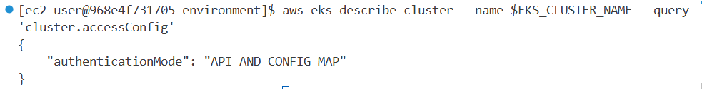
**Step 2:** List existing access entries
```bash
aws eks list-access-entries --cluster $EKS_CLUSTER_NAME
```

**Step 3:** List available access policies
```bash
aws eks list-access-policies
```


---

### Associating Access Policies

#### 1. Create Read-Only Access

1. Create access entry for read-only IAM role:
```bash
aws eks create-access-entry --cluster-name $EKS_CLUSTER_NAME \
  --principal-arn $READ_ONLY_IAM_ROLE
```

2. Associate AmazonEKSViewPolicy with cluster-wide scope:
```bash
aws eks associate-access-policy --cluster-name $EKS_CLUSTER_NAME \
  --principal-arn $READ_ONLY_IAM_ROLE \
  --policy-arn arn:aws:eks::aws:cluster-access-policy/AmazonEKSViewPolicy \
  --access-scope type=cluster
```


3. Set up kubeconfig for read-only context:
```bash
aws eks update-kubeconfig --name $EKS_CLUSTER_NAME \
  --role-arn $READ_ONLY_IAM_ROLE --alias readonly --user-alias readonly
```
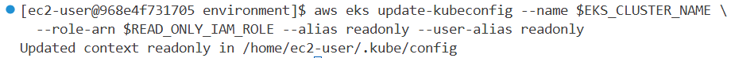

4. Test read access (should work):
```bash
kubectl --context readonly get pod -A
```


5. Test delete access (should fail):
```bash
kubectl --context readonly delete pod -n ui --all
# Error: Forbidden
```

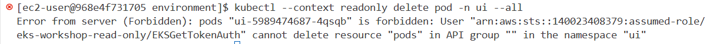

#### 2. Namespace-Scoped Access

1. Associate policy scoped to specific namespace:
```bash
aws eks associate-access-policy --cluster-name $EKS_CLUSTER_NAME \
  --principal-arn $READ_ONLY_IAM_ROLE \
  --policy-arn arn:aws:eks::aws:cluster-access-policy/AmazonEKSViewPolicy \
  --access-scope type=namespace,namespaces=carts
```


2. Test namespace access (should work):
```bash
kubectl --context readonly get pod -n carts
```
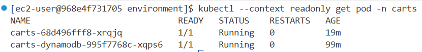

3. Test cluster-wide access (should fail):
```bash
kubectl --context readonly get pod -A
# Error: Forbidden
```


4. List associated policies:
```bash
aws eks list-associated-access-policies --cluster-name $EKS_CLUSTER_NAME --principal-arn $READ_ONLY_IAM_ROLE
```


---

### Integrating with Kubernetes RBAC

For fine-grained permissions beyond pre-defined access policies, use Kubernetes RBAC groups.

#### 3. Custom RBAC Permissions

1. Create Kubernetes Role (view all + delete pods in carts namespace):
```yaml
apiVersion: rbac.authorization.k8s.io/v1
kind: Role
metadata:
  name: carts-team-role
  namespace: carts
rules:
- apiGroups: ["*"]
  resources: ["*"]
  verbs: ["get", "list", "watch"]
- apiGroups: [""]
  resources: ["pods"]
  verbs: ["delete"]
```

2. Create RoleBinding to map Role to group `carts-team`:
```yaml
apiVersion: rbac.authorization.k8s.io/v1
kind: RoleBinding
metadata:
  name: carts-team-binding
  namespace: carts
roleRef:
  apiGroup: rbac.authorization.k8s.io
  kind: Role
  name: carts-team-role
subjects:
- kind: Group
  name: carts-team
```

3. Apply RBAC manifests:
```bash
kubectl --context default apply -k ~/environment/eks-workshop/modules/security/cam/rbac
```

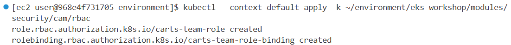

4. Create access entry with Kubernetes group:
```bash
aws eks create-access-entry --cluster-name $EKS_CLUSTER_NAME \
  --principal-arn $CARTS_TEAM_IAM_ROLE \
  --kubernetes-groups carts-team
```


5. Set up kubeconfig for carts-team context:
```bash
aws eks update-kubeconfig --name $EKS_CLUSTER_NAME \
  --role-arn $CARTS_TEAM_IAM_ROLE --alias carts-team --user-alias carts-team
```

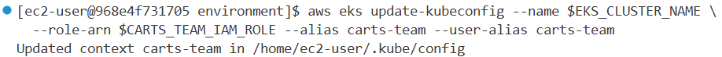

6. Test permissions:
```bash
# View pods (works)
kubectl --context carts-team get pod -n carts

# Delete pods (works)
kubectl --context carts-team delete pod --all -n carts

# Delete deployment (forbidden)
kubectl --context carts-team delete deployment --all -n carts

# Access other namespace (forbidden)
kubectl --context carts-team get pod -n catalog
```


---

### Migrating from aws-auth ConfigMap

#### 4. Migrate Existing Identity Mapping

1. Check current aws-auth ConfigMap:
```bash
kubectl --context default get -n kube-system cm aws-auth -o yaml
```
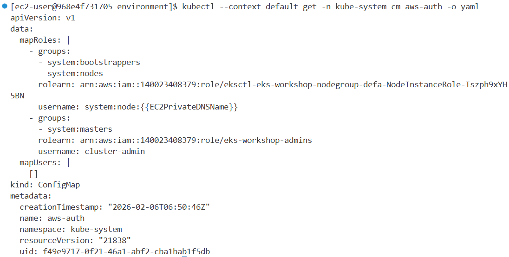

2. Set up kubeconfig for admins role:
```bash
aws eks update-kubeconfig --name $EKS_CLUSTER_NAME \
  --role-arn $ADMINS_IAM_ROLE --alias admins --user-alias admins
```
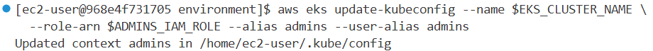

3. Verify access works via aws-auth:
```bash
kubectl --context admins get pod -n carts
```
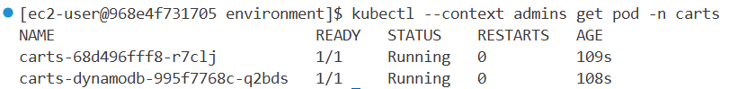

4. Delete aws-auth entry:
```bash
eksctl delete iamidentitymapping --cluster $EKS_CLUSTER_NAME --arn $ADMINS_IAM_ROLE
```


5. Verify access is now denied:
```bash
kubectl --context admins get pod -n carts
# Error: Unauthorized
```
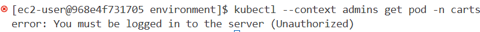

6. Create access entry via Cluster Access Management API:
```bash
aws eks create-access-entry --cluster-name $EKS_CLUSTER_NAME \
  --principal-arn $ADMINS_IAM_ROLE
```


7. Associate cluster admin policy:
```bash
aws eks associate-access-policy --cluster-name $EKS_CLUSTER_NAME \
  --principal-arn $ADMINS_IAM_ROLE \
  --policy-arn arn:aws:eks::aws:cluster-access-policy/AmazonEKSClusterAdminPolicy \
  --access-scope type=cluster
```


8. Verify access is restored:
```bash
kubectl --context admins get pod -n carts
```
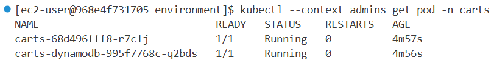


## 4. Pod Security Standards

### Overview
Pod Security Standards (PSS) define three different policies to cover the security spectrum, implemented through Pod Security Admission (PSA) controller. PSA is enabled by default in Amazon EKS from Kubernetes version 1.23.

### PSS Policy Levels

| Level | Description |
|-------|-------------|
| **Privileged** | Unrestricted policy, allows known privilege escalations. Good for system-wide apps (logging agents, CNIs, storage drivers) |
| **Baseline** | Minimally restrictive, prevents known privilege escalations. Prohibits hostNetwork, hostPID, hostIPC, hostPath, hostPort, adding Linux capabilities |
| **Restricted** | Heavily restricted, follows Pod hardening best practices. Adds restrictions like inability to run as root |

### PSA Modes

| Mode | Behavior |
|------|----------|
| **enforce** | Policy violations cause Pod rejection |
| **audit** | Violations trigger audit annotation in audit log |
| **warn** | Violations trigger user-facing warning |

### Namespace Labels
```
pod-security.kubernetes.io/<MODE>: <LEVEL>
pod-security.kubernetes.io/<MODE>-version: <VERSION>
```

---

### Prepare Environment
```bash
prepare-environment security/pss-psa
```

---

### 1. Deploy Test Workload

1. Apply test workload in `pss` namespace:
```bash
kubectl apply -k ~/environment/eks-workshop/modules/security/pss-psa/workload
kubectl rollout status -n pss deployment/pss --timeout=60s
```


2. Verify namespace has no PSA labels by default:
```bash
kubectl describe ns pss
```


3. Check running deployment and pod:
```bash
kubectl -n pss get deployment
kubectl -n pss get pod
```


---

### 2. Privileged PSS Profile

The Privileged profile is most permissive and allows privilege escalations. It's the default cluster-wide setting.

1. Check current pod security configuration:
```bash
kubectl -n pss get deployment pss -o yaml | yq '.spec.template.spec'
```

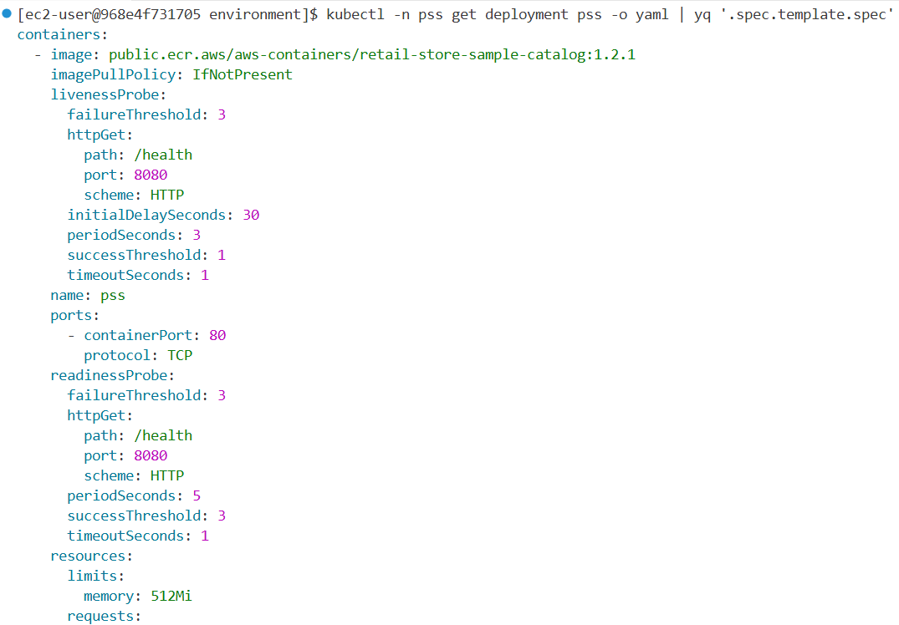

2. Apply privileged workload (adds `privileged: true` and `runAsUser: 0`):
```bash
kubectl apply -k ~/environment/eks-workshop/modules/security/pss-psa/privileged-workload
kubectl rollout status -n pss deployment/pss --timeout=60s
```

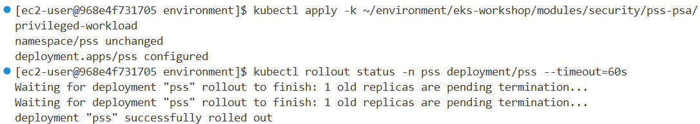

3. Verify pod runs with root user:
```bash
kubectl -n pss get pod
kubectl -n pss exec $(kubectl -n pss get pods -o name) -- whoami
# Output: root
```

**Result:** Default PSA allows Pods with elevated security permissions.


---

### 3. Baseline PSS Profile

The Baseline profile prevents known privilege escalations.

1. Apply Baseline namespace labels:
```bash
kubectl apply -k ~/environment/eks-workshop/modules/security/pss-psa/baseline-namespace
# Warning: existing pods violate "baseline:latest" - privileged
```

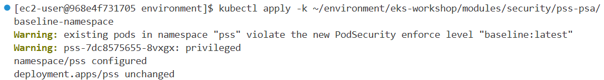

2. Delete existing pods to trigger PSA enforcement:
```bash
kubectl -n pss delete pod --all
```
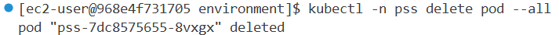

3. Check pods (none running due to violations):
```bash
kubectl -n pss get pod
# No resources found
```
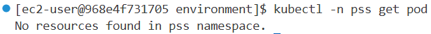

4. Inspect deployment status for error message:
```bash
kubectl get deployment -n pss pss -o yaml | yq '.status'
# Message: violates PodSecurity "baseline:latest": privileged
```


5. Fix deployment by removing privileged flag:
```bash
kubectl apply -k ~/environment/eks-workshop/modules/security/pss-psa/baseline-workload
kubectl rollout status -n pss deployment/pss --timeout=60s
```


6. Verify pod runs with non-root user:
```bash
kubectl -n pss get pod
kubectl -n pss exec $(kubectl -n pss get pods -o name) -- whoami
# Output: appuser
```

**Result:** Baseline profile blocks privileged containers.


---

### 4. Restricted PSS Profile

The Restricted profile is the most heavily restricted policy.

1. Apply Restricted namespace labels:
```bash
kubectl apply -k ~/environment/eks-workshop/modules/security/pss-psa/restricted-namespace
# Warning: violate "restricted:latest" - allowPrivilegeEscalation, runAsNonRoot, seccompProfile
```
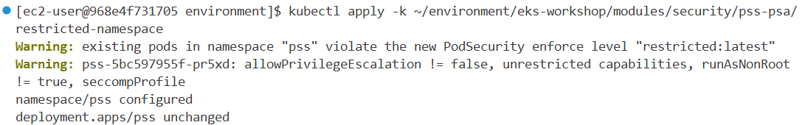

2. Delete existing pods:
```bash
kubectl -n pss delete pod --all
```
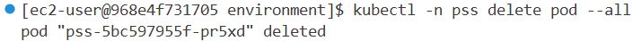

3. Check pods (none running):
```bash
kubectl -n pss get pod
# No resources found
```
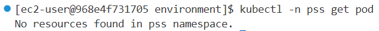

4. Apply compliant workload with security controls:
```bash
kubectl apply -k ~/environment/eks-workshop/modules/security/pss-psa/restricted-workload
kubectl rollout status -n pss deployment/pss --timeout=60s
```

Required security configurations for Restricted profile:
```yaml
securityContext:
  allowPrivilegeEscalation: false
  runAsNonRoot: true
  seccompProfile:
    type: RuntimeDefault
  capabilities:
    drop:
      - ALL
```


5. Verify pod is running:
```bash
kubectl -n pss get pod
```

**Result:** Restricted profile requires explicit security hardening configurations.

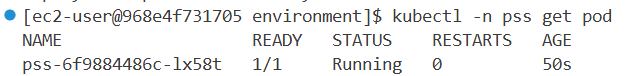

## 5. Policy Management with Kyverno

### Overview
Kyverno (Greek for "govern") is a policy engine specifically designed for Kubernetes. It's a CNCF project that enables teams to enforce Policy-as-Code. Kyverno operates as a Dynamic Admission Controller, receiving webhook callbacks from the Kubernetes API server.

### Key Features
- **Validate** - Block or allow resource creation based on rules
- **Mutate** - Modify resources during creation
- **Generate** - Create new resources based on triggers

### Prepare Environment
```bash
prepare-environment security/kyverno
```

This installs:
- Kyverno Policy Manager
- Kyverno Policies
- Policy Reporter

---

How Kyverno Work?


### Verify Kyverno Installation
```bash
kubectl -n kyverno get all
```


---

### 1. Creating a Simple Validation Policy

Create a policy that requires `CostCenter` label on all Pods.

1. Apply the require-labels policy:
```bash
kubectl apply -f ~/environment/eks-workshop/modules/security/kyverno/simple-policy/require-labels-policy.yaml
```

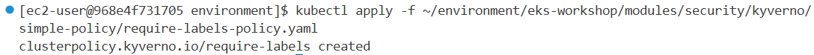

2. Check existing pods in ui namespace (no required label):
```bash
kubectl -n ui get pods --show-labels
```


3. Delete existing pod to test policy:
```bash
kubectl -n ui delete pod --all
kubectl -n ui get pods
# No resources found
```

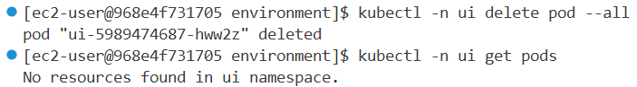

4. Try to restart deployment (will fail):
```bash
kubectl -n ui rollout restart deployment/ui
# Error: admission webhook denied - Label 'CostCenter' is required
```
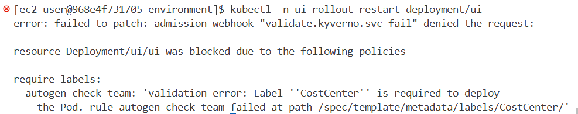


5. Check events for policy violation:
```bash
kubectl -n ui get events | grep PolicyViolation
```

6. Apply deployment with required label:
```bash
kubectl apply -k ~/environment/eks-workshop/modules/security/kyverno/simple-policy/ui-labeled
kubectl -n ui rollout status deployment/ui
```


7. Verify pod created with label:
```bash
kubectl -n ui get pods --show-labels
# Shows CostCenter=IT label
```


---

### 2. Mutation Policy

Create a policy that automatically adds labels to Pods.

1. Apply mutation policy:
```bash
kubectl apply -f ~/environment/eks-workshop/modules/security/kyverno/simple-policy/add-labels-mutation-policy.yaml
```
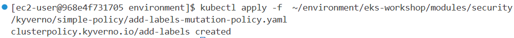

2. Rollout deployment without explicit label:
```bash
kubectl -n carts rollout restart deployment/carts
kubectl -n carts rollout status deployment/carts
```


3. Verify label was automatically added:
```bash
kubectl -n carts get pods --show-labels
# CostCenter=IT label automatically added
```


---

### 3. Enforcing Pod Security Standards (Baseline)

Create a Baseline policy that prevents known privilege escalations.

1. Test running privileged pod (before policy):
```bash
kubectl run privileged-pod --image=nginx --restart=Never --privileged
kubectl delete pod privileged-pod
```


2. Apply Baseline policy:
```bash
kubectl apply -f ~/environment/eks-workshop/modules/security/kyverno/baseline-policy/baseline-policy.yaml
```
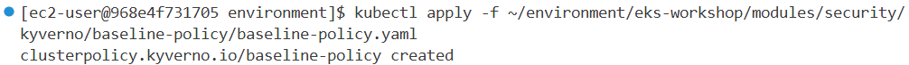
3. Try to run privileged pod again (blocked):
```bash
kubectl run privileged-pod --image=nginx --restart=Never --privileged
# Error: blocked - violates PodSecurity "baseline:latest"
# privileged container not allowed
```

**Result:** Baseline policy prevents privileged containers.

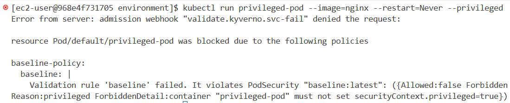

---

### 4. Restricting Image Registries

Create a policy that only allows images from trusted registries.

1. Test running pod from public registry (before policy):
```bash
kubectl run nginx --image=nginx
kubectl describe pod nginx | grep Image
# Image from docker.io
```


2. Apply restrict-registries policy (only allow public.ecr.aws):
```bash
kubectl apply -f ~/environment/eks-workshop/modules/security/kyverno/images/restrict-registries.yaml
```
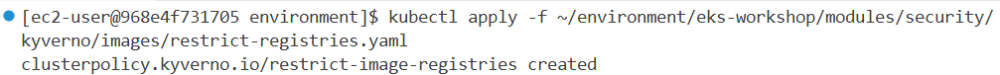

3. Try to run pod from public registry (blocked):
```bash
kubectl run nginx-public --image=nginx
# Error: blocked - Unknown Image registry
```


4. Run pod from trusted registry (allowed):
```bash
kubectl run nginx-ecr --image=public.ecr.aws/nginx/nginx
# pod/nginx-ecr created
```

**Result:** Only images from public.ecr.aws are allowed.

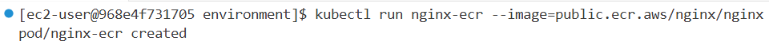

---

### 5. Policy Reports & Auditing

Kyverno generates Policy Reports for all policy validations.

1. View all policy reports:
```bash
kubectl get policyreports -A
```


2. View blocked events:
```bash
kubectl get events | grep block
```


3. View reports for specific namespace:
```bash
kubectl get policyreports
```


4. Describe specific policy report for details:
```bash
kubectl describe policyreport cpol-restrict-image-registries
```
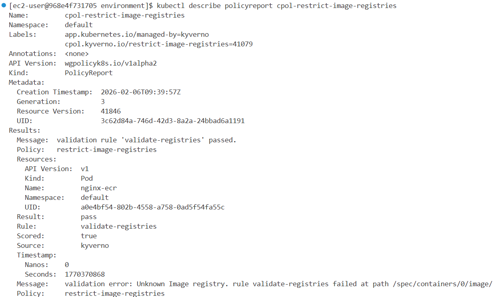

**Report Fields:**
| Field | Description |
|-------|-------------|
| PASS | Resources compliant with policy |
| FAIL | Resources violating policy (in Audit mode) |
| WARN | Warning-level violations |
| ERROR | Policy evaluation errors |
| SKIP | Skipped evaluations |

**Note:** 
- `Audit` mode: Allows resources and reports in Policy Reports
- `Enforce` mode: Blocks resources, records in Kubernetes events (not in Policy Reports)