# EKS Security Guide

## Overview

Security at AWS is the highest priority, and is a shared responsibility between AWS and customers. When using a managed service like Amazon EKS, AWS is responsible for security "of" the cloud whereas you, the customer, are responsible for security "in" the cloud.


---

## 1. Amazon EKS Pod Identity

### Overview
EKS Pod Identities provide the ability to manage AWS credentials for applications, similar to how Amazon EC2 Instance Profiles provide credentials to instances. Instead of creating and distributing AWS credentials to containers, you associate an IAM role with a Kubernetes Service Account.

### Prepare Environment
```bash
prepare-environment security/eks-pod-identity
```

This creates:
- Amazon DynamoDB table
- IAM role for EKS workloads
- AWS Load Balancer Controller

### Amazon EKS Pod Identity
#### Introduction
1. Check carts pod:
``` bash
kubectl -n carts get pod
```
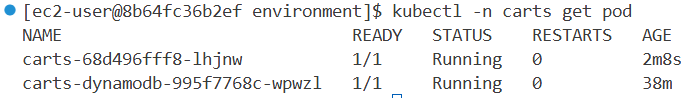
2. Verify carts application is using
``` bash
kubectl -n carts exec deployment/carts -- env | grep RETAIL_CART_PERSISTENCE_DYNAMODB_ENDPOINT
```
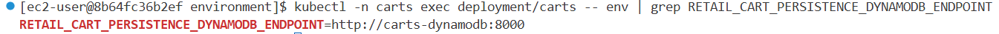
#### Using Amazon DynamoDB
1. re-configure the carts service to use a DynamoDB table

2.  check the current status of the application using the browser
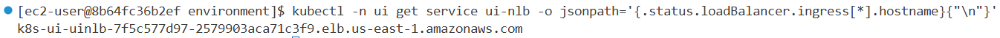
3.  open the Retail Store
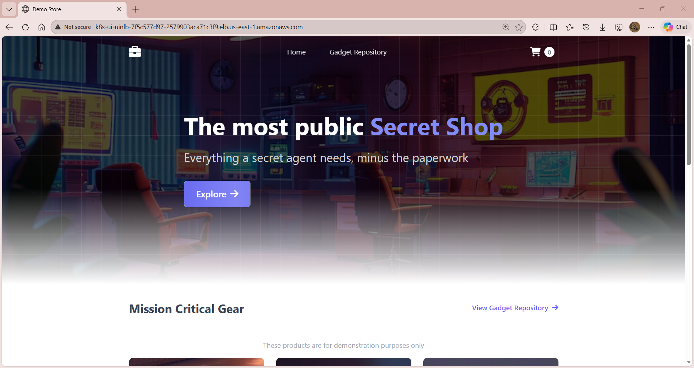
4.  check the value of CARTS_DYNAMODB_TABLENAME then run Kustomize to use the real DynamoDB service:
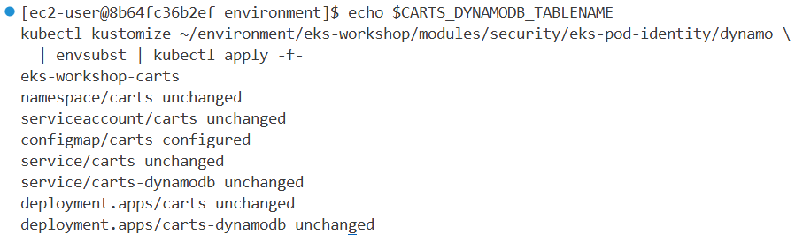
5.  This will overwrite our ConfigMap with new values:
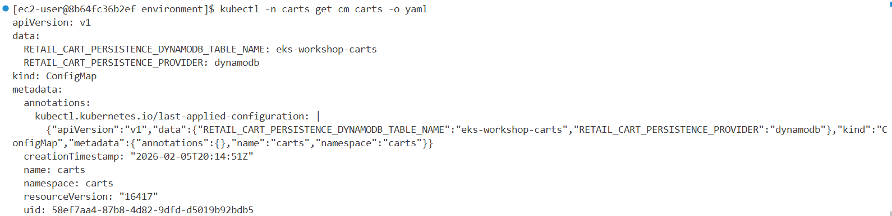
6.  recycle all the carts pods to pick up our new ConfigMap contents:

7.  It looks like our change failed to deploy properly. We can confirm this by looking at the Pods:
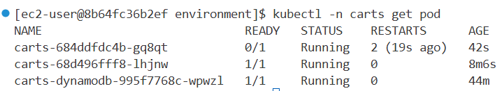
#### Understanding Pod IAM

#### Using EKS Pod Identity
**Step 1:** Install EKS Pod Identity Agent addon
```bash
aws eks create-addon --cluster-name $EKS_CLUSTER_NAME --addon-name eks-pod-identity-agent
aws eks wait addon-active --cluster-name $EKS_CLUSTER_NAME --addon-name eks-pod-identity-agent
```
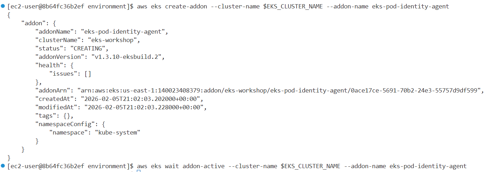
**Step 2:** Verify Pod Identity Agent DaemonSet
```bash
kubectl -n kube-system get daemonset eks-pod-identity-agent
kubectl -n kube-system get pods -l app.kubernetes.io/name=eks-pod-identity-agent
```
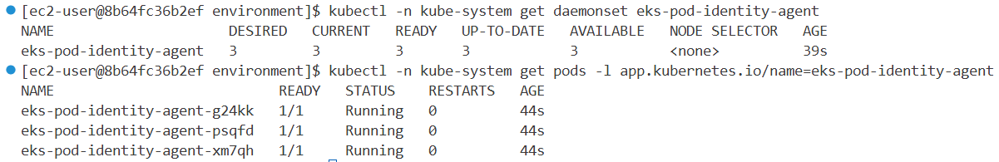
**Step 3:** View IAM policy for DynamoDB access
```bash
aws iam get-policy-version \
  --version-id v1 --policy-arn \
  --query 'PolicyVersion.Document' \
  arn:aws:iam::${AWS_ACCOUNT_ID}:policy/${EKS_CLUSTER_NAME}-carts-dynamo | jq .
```

**Step 4:** Verify trust relationship (EKS Service Principal)
```bash
aws iam get-role \
  --query 'Role.AssumeRolePolicyDocument' \
  --role-name ${EKS_CLUSTER_NAME}-carts-dynamo | jq .
```

**Step 5:** Create Pod Identity association
```bash
aws eks create-pod-identity-association \
  --cluster-name $EKS_CLUSTER_NAME \
  --namespace carts \
  --service-account carts \
  --role-arn arn:aws:iam::${AWS_ACCOUNT_ID}:role/${EKS_CLUSTER_NAME}-carts-dynamo
```
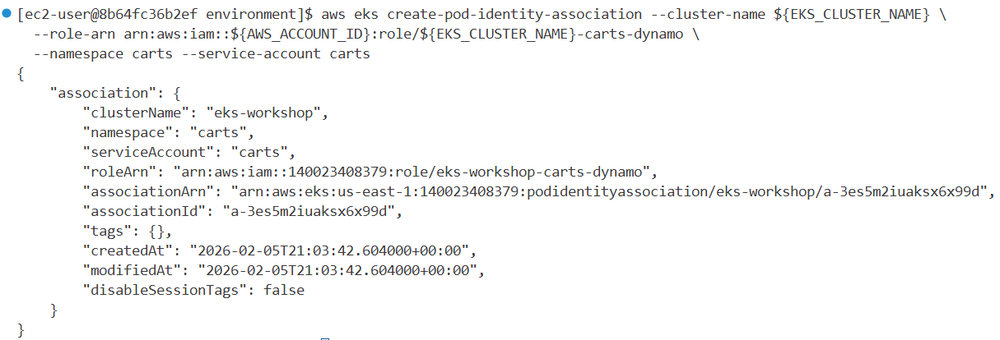
**Step 6:** Restart pods to pick up new identity
```bash
kubectl rollout restart -n carts deployment/carts
kubectl rollout status -n carts deployment/carts --timeout=60s
```


---
#### Verifying DynamoDB access
1. Now, with the carts Service Account associated with the authorized IAM role, the carts Pod has permission to access the DynamoDB table. Access the web store again and navigate to the shopping cart.

2. Now cart can be access

3. After the AWS IAM role is associated with the Service Account, any newly created Pods using that Service Account will be intercepted by the EKS Pod Identity webhook. This webhook runs on the Amazon EKS cluster's control plane and is fully managed by AWS. Take a closer look at the new carts Pod to see the new environment variables:
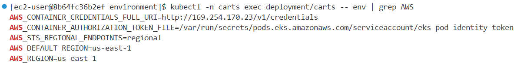

Notable points about these environment variables:

- AWS_DEFAULT_REGION - The region is set automatically to the same as our EKS cluster
- AWS_STS_REGIONAL_ENDPOINTS - Regional STS endpoints are configured to avoid putting too much pressure on the global endpoint in us-east-1
- AWS_CONTAINER_CREDENTIALS_FULL_URI - This variable tells AWS SDKs how to obtain credentials using the HTTP credential provider. This means that EKS Pod Identity does not need to inject credentials via something like an AWS_ACCESS_KEY_ID/AWS_SECRET_ACCESS_KEY pair, and instead the SDKs can have temporary credentials vended to them via the EKS Pod Identity mechanism. You can read more about how this functions in the AWS documentation.